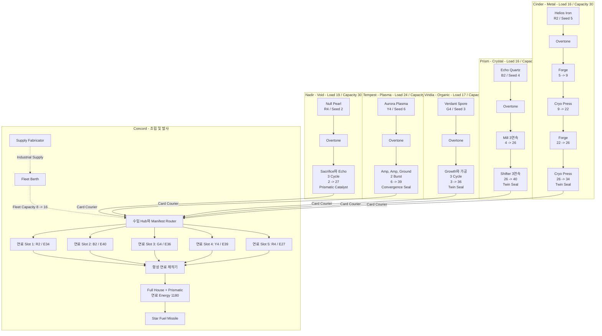
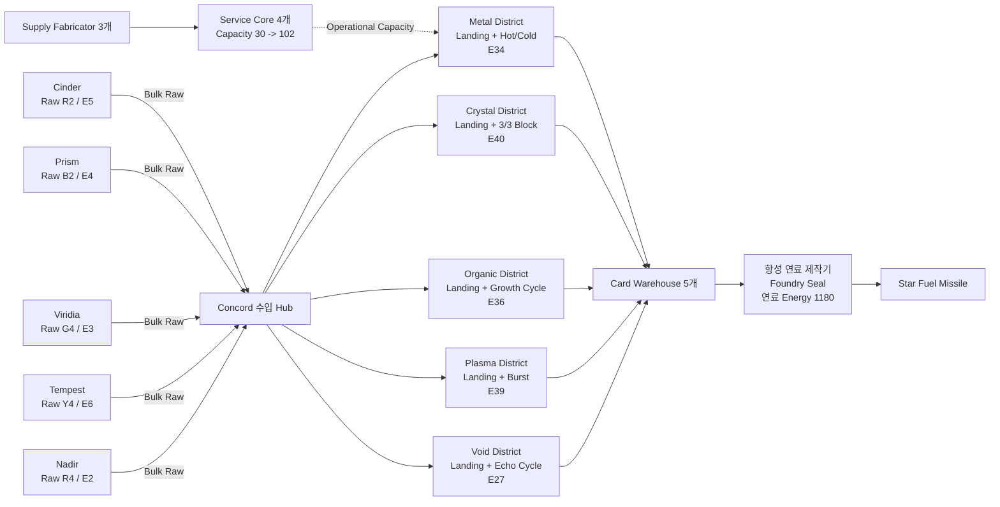
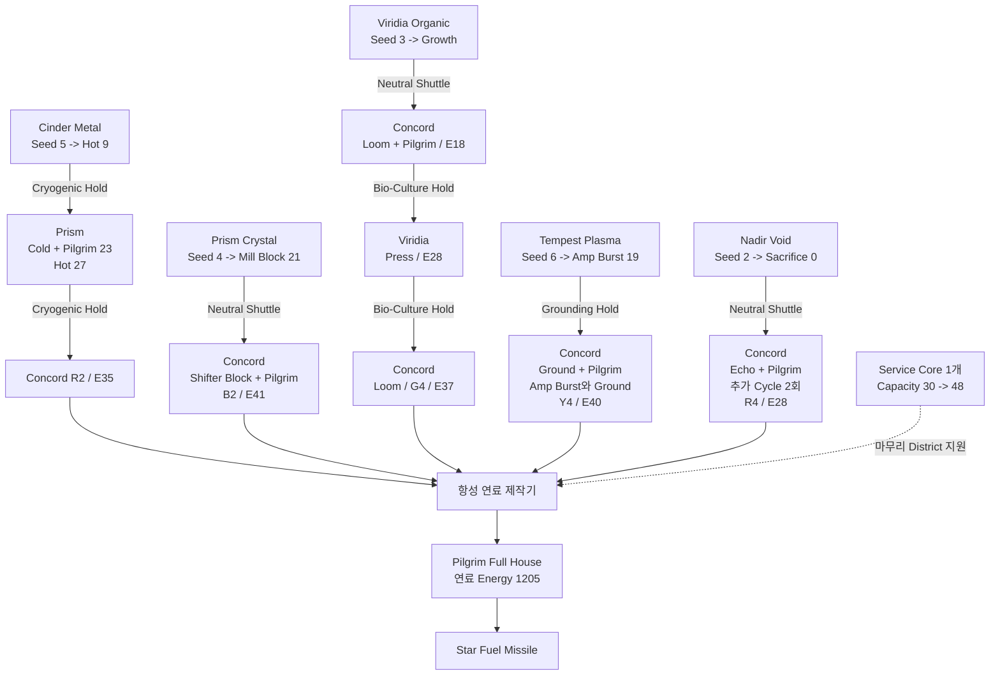

# 자동화 Line 기준 Run

## 1. 목적과 문서 상태

이 문서는 Resource, Tag, Facility, Augment, 물류, 항성 연료 시스템을 하나로 연결한 수치 기반 Reference Vertical Slice다.

- 제안한 규칙으로 완성된 자동화망을 실제로 만들 수 있는지 검증한다.
- 같은 5장 목표를 사용하여 분산형·중앙집중형·순차형 배치를 비교한다.
- 모든 수치는 최종 Balance 확정값이 아니라 Prototype 기준값이다.
- 일반 가공은 합연산만 사용한다.
- 항성 연료 제작기에서만 한 번 곱연산한다.
- 가공 횟수 제한은 없다.

규칙의 본문은 [ResourceSystemDesign.md](ResourceSystemDesign.md)와 [AutomationLineProgressionDesign.md](AutomationLineProgressionDesign.md)에 있다. 이 문서의 시험 수치를 변경해도 시스템 원칙이 자동으로 바뀌는 것은 아니다.

## 2. 기준 Run

### 2.1 천체 구성

예시 Run에는 행성 6개와 위성 2개가 있다.

| 천체 | 종류 | 주된 역할 |
|---|---|---|
| Cinder | Hot 행성 | Helios Iron 산지와 Hot Metal 가공 |
| Prism | 얼음 위성 | Echo Quartz 산지와 Cold 가공 |
| Viridia | 해양 행성 | Verdant Spore 산지와 Organic 성장 |
| Tempest | 폭풍 행성 | Aurora Plasma 산지와 빠른 증폭 |
| Nadir | 외곽 행성 | Null Pearl 산지와 Void 희생 |
| Concord | 온대 행성 | 중앙 Hub, 연료 조립, 항성 발사 |
| Pelagos | 행성 | 아직 역할이 없는 Pivot 또는 지원 천체 |
| Rime | 위성 | 아직 역할이 없는 Cold Route 대안 |

사용하지 않은 천체도 중요하다. 후반 Augment가 새로운 Family, 지원 산업, Route 배치를 요구할 때 Run을 전환할 여지를 제공한다.

### 2.2 목표 카드 5장

세 배치 모두 같은 카드를 사용한다.

| 자원 | Origin | Family | Seed Energy | Spectrum | Rank | Card Key |
|---|---|---|---:|---|---:|---|
| Helios Iron | Cinder | Metal | 5 | Red | 2 | R2 |
| Echo Quartz | Prism | Crystal | 4 | Blue | 2 | B2 |
| Verdant Spore | Viridia | Organic | 3 | Green | 4 | G4 |
| Aurora Plasma | Tempest | Plasma | 6 | Yellow | 4 | Y4 |
| Null Pearl | Nadir | Void | 2 | Red | 4 | R4 |

족보 계산에 사용하는 카드는 다음과 같다.

~~~text
R2, B2, G4, Y4, R4
~~~

이 조합은 다음 조건을 만족한다.

- Rank 2 Pair
- Rank 4 Three of a Kind
- Full House
- Spectrum 4종 모두 포함
- 중복 Card Key 없음

기준 Full House 보너스:

~~~text
족보 B 보너스 = +30
족보 C 보너스 = +3
~~~

이 예시는 최종 Rank 범위가 1-5든 1-7이든 작동한다. Rank 개수에 대한 미결정 사항을 확정하지는 않는다.

### 2.3 Family State 기준 수치

| Family | 긍정 State 기준값 | 부정 State 기준값 | 권장 주기 |
|---|---|---|---|
| Metal | Tempered가 유효 Cold 가공에 `+5` | 같은 Archetype 세 번째부터 Fatigued `-8` | Hot -> Cold, Archetype 교대 |
| Crystal | 같은 Archetype 두 번째·세 번째에 Resonant `+4` | 네 번째 이후 Fractured `-10` | A -> A -> A -> B -> B -> B |
| Organic | 다음 일반 가공에 Matured `+6` | Growth 없이 두 번째 일반 가공부터 Depleted `-7` | Growth -> Process |
| Plasma | 다음 연속 Amplification에 Energized `+5` | Discharge 전 세 번째 이후 Overloaded `-10` | Amplify -> Amplify -> Discharge |
| Void | 다음 증가에 `실제 희생 Energy * 2`, 최대 `+8`의 Echoing | Sacrifice 없는 두 번째 증가부터 Collapsed `-8` | Sacrifice -> Gain |

Void의 `실제 희생 Energy`는 0 Clamp를 적용한 뒤, Tag 보너스를 더하기 전에 기록한다. 따라서 Energy가 0인 자원을 희생해 무료 Echo 보너스를 만들 수 없다.

## 3. 기준 운영 Economy

### 3.1 Operational Capacity

Prototype 기준값:

| 규칙 | 기준값 |
|---|---:|
| 천체당 무료 Operational Capacity | 30 |
| 보급 중인 Service Core 하나의 Capacity | +18 |
| Service Core 소비량 | 30초당 Industrial Supply 1 |
| Service Core 내부 비축량 | 120초 |

~~~text
사용 가능 Capacity = 30 + 18 * 보급 중인 Service Core 수
~~~

같은 우선순위 Group의 Demand가 60인데 남은 Capacity가 45라면:

~~~text
Speed Factor = 45 / 60 = 0.75
~~~

해당 Group의 모든 Facility가 75% 속도로 작동한다. 자원을 거부하거나 진행 중인 작업을 잃지 않는다.

우선순위:

1. Critical
2. Normal
3. Background

Supply Fabricator, 복구용 Route 하나, 항성 연료 제작기는 Critical로 설정할 수 있다. 선택적 장거리 가공 Loop는 보통 Normal 또는 Background로 둔다.

### 3.2 Industrial Supply

Industrial Supply는 연료 카드가 아닌 `Utility` 물자다.

기준 Recipe:

~~~text
Common Ore 1 + Biomass Feedstock 1
-> Industrial Supply 2
Cycle Time: 30초
Operational Load: 4
~~~

Fleet Berth 같은 다른 소비처를 제외하면 Supply Fabricator 하나가 기준 비율에서 Service Core 두 개를 유지한다.

현재 목표 족보에 필요한 특정 Spectrum이나 Rank를 강제로 희생하지 않도록 낮은 가치의 공용 입력을 사용한다.

### 3.3 Fleet Capacity

Prototype 기준값:

| 규칙 | 기준값 |
|---|---:|
| Hub당 무료 Fleet Capacity | 8 |
| 보급 중인 Fleet Berth 하나의 Capacity | +8 |
| Fleet Berth 소비량 | 60초당 Industrial Supply 1 |

| Route 설정 | 화물 역할 | Cargo 수 | 각 종점의 Fleet Load |
|---|---|---:|---:|
| Card Courier | 완성된 동질 카드 | 8 | 2 |
| Neutral Shuttle | Raw 또는 Intermediate Cargo | 8 | 2 |
| Bulk Raw Hold | Raw 동질 Cargo | 16 | 3 |
| Conditioned Hold | 이동 중 Family Action 수행 | 4 | 3 |

Fleet Load가 Capacity를 넘으면 이후 출발이 보이는 Queue에서 대기한다. Cargo는 Export Buffer에 안전하게 남는다.

## 4. 구체적인 Facility 목록

### 4.1 공용 Facility

| Facility | 주 행동 | Energy 규칙 | Cycle | Operational Load | 접근 방식 |
|---|---|---|---:|---:|---|
| Universal Extractor | 채굴 | Seed Energy 상태의 Instance 생성 | 4초 | 2 | 시작 |
| Pulse Processor | Pulse 가공 | `+3` | 3초 | 2 | 시작 |
| Compression Mill | Compression 가공 | `+4` | 4초 | 3 | 시작 |
| Tag Imprinter | Process Tag 적용 | `+0`, Family 이력 진행 없음 | 2초 | 1 | Tag와 함께 확정 제공 |
| Fuel Imprinter | Fuel Imprint 적용 | `+0`, Family 이력 진행 없음 | 2초 | 1 | Tag와 함께 확정 제공 |
| Tag Scrubber | Tag 제거 | `+0`, Family State 해제 없음 | 2초 | 1 | Tag와 함께 확정 제공 |
| Supply Fabricator | Utility 생산 | Industrial Supply 생산 | 30초 | 4 | 확장 전에 확정 제공 |
| Service Core | Capacity 확장 | 보급 중 천체 Capacity `+18` | Passive | 0 | 확장 전에 확정 제공 |
| 항성 연료 제작기 | 최종 합성 | `A + B * C`를 한 번 판정 | 10초 | 6 | 확정 진행 |

두 시작 Processor는 안전하지만 Family 전용 Facility보다 효율이 낮다. 특화 District나 Route가 막혔을 때에도 대체 Line을 만들 수 있게 한다.

### 4.2 Family Facility

| Facility | Family | Archetype 또는 Action | 기본 Energy 변화 | Cycle | Load | 추가 규칙 |
|---|---|---|---:|---:|---:|---|
| Induction Forge | Metal | Forge, Hot | +4 | 4초 | 3 | Hot 기록 |
| Cryo Press | Metal | Press, Cold | +3 | 4초 | 3 | Tempered 완성 가능 |
| Resonance Mill | Crystal | Resonance | +3 | 3초 | 반복으로 Resonant 활성화 |
| Facet Shifter | Crystal | Facet | +2 | 3초 | Archetype 변경 및 Fractured 해제 |
| Growth Vat | Organic | Growth Cycle | +0 | 6초 | Matured 활성화 및 Depleted 해제 |
| Enzyme Loom | Organic | Loom | +3 | 3초 | 일반 가공 |
| Spore Press | Organic | Press | +4 | 4초 | 느리지만 강한 일반 가공 |
| Arc Amplifier | Plasma | Amplification | +4 | 2초 | Energized·Overloaded 주기 진행 |
| Grounding Coil | Plasma | Discharge | +1 | 2초 | Energized·Overloaded 해제 |
| Null Sink | Void | Void Sacrifice | 최대 -3 | 2초 | 실제 희생량 기록 및 Echoing 활성화 |
| Echo Chamber | Void | Energy Gain | +4 | 4초 | Echoing 보너스 소비 |

올바른 Family 주기는 순이득이지만 Reset Action이 무료는 아니다. Line을 늘릴수록 더 많은 활성 Facility, Cycle Time, 지원 Capacity가 필요하다.

### 4.3 물류 Facility와 Module

| Facility 또는 Module | 이 기준안의 접근 방식 | 규칙 |
|---|---|---|
| Export Buffer | Technology | Manifest와 일치하는 동질 Batch 생성 |
| Import Buffer | Technology | Energy, State, Tag, 이력 보존 |
| Card Warehouse | Technology | 설정된 Card Key와 Fuel Imprint 하나를 예약 |
| Fuel Assembly Buffer | Technology | 설정된 5장 Set이 완성되어야 방출 |
| Manifest Router | Technology | Resource, Family, Spectrum, Rank, Energy, State, Tag, 단계로 Filter |
| Fleet Berth | Technology | 보급 중 Fleet Capacity +8 |
| Cryogenic Hold | Deep-Space Tempering Augment | Capacity 4, 도착 시 기본 `+3` Cold 가공 |
| Bio-Culture Hold | Bio-Ark Freight Augment | Capacity 4, 유효 이동 중 Growth Cycle 하나 완료 |
| Grounding Hold | Grounded Transit Augment | Capacity 4, 도착 시 기본 `+1` Discharge |

일반 Hold는 State 중립이다. Conditioned Hold는 Preview, Load 계산, 자원 이력에 명시적인 가공 단계로 나타난다.

## 5. 구체적인 Tag 목록

### 5.1 Process Tag

| Tag | Trigger | 효과 | 생명주기 |
|---|---|---|---|
| Overtone | 긍정 Family State 활성화 | `Current Energy +5` | 한 번 발동 후 Spent |
| Reclamation | 부정 Family State 해제 | `Current Energy +7` | 한 번 발동 후 Spent |
| Crosslink | Process Archetype 변경 | `Current Energy +4` | 한 번 발동 후 Spent |
| Landing Charge | 수입 후 첫 Energy 변화 가공 | `Current Energy +5` | 한 번 발동 후 Spent |
| Pilgrim Charge | Origin 밖의 첫 유효 가공 | `Current Energy +6` | 한 번 발동 후 Spent |

Tag 적용은 일반 Family 가공이 아니다. Hot -> Cold 순서를 끊거나, 반복 Archetype Counter를 올리거나, Organic 일반 가공으로 세거나, 기존 State를 소비하지 않는다.

### 5.2 Fuel Imprint

| Imprint | 최종 조건 | 최종 효과 |
|---|---|---|
| Twin Seal | 소유 카드가 유효한 같은 Rank 묶음에 참여 | 해당 카드로 `B +6` |
| Convergence Seal | 서로 다른 Origin의 카드 3장 이상이 각자의 Origin에서 마지막 일반 가공 후 수출 | Batch당 `B +12` |
| Foundry Seal | 카드 5장이 모두 제작기 천체에서 마지막 일반 가공 완료 | Batch당 `B +12` |
| Pilgrim Seal | 카드 5장이 모두 Origin 밖에서 유효 가공을 한 번 이상 완료 | Batch당 `B +12` |
| Prismatic Catalyst | Batch에 Spectrum 4종이 모두 존재 | Batch당 `C +1` |

제작기는 Batch당 Topology Seal 보너스 하나와 Catalyst 보너스 하나만 인정한다. 중복 Topology Seal도 유효 입력이지만 추가 효과가 비활성이라는 사실을 Preview에서 보여준다.

### 5.3 공통 Imprint 배치

아래 세 Topology 모두 다음 Slot 구성을 사용한다.

| 카드 Slot | Fuel Imprint |
|---|---|
| Slot 1 | Twin Seal |
| Slot 2 | Twin Seal |
| Slot 3 | Twin Seal |
| Slot 4 | Topology Seal |
| Slot 5 | Prismatic Catalyst |

따라서:

~~~text
최종 Tag B 보너스 = 3 * 6 + 12 = 30
최종 Tag C 보너스 = 1
~~~

Slot 제한에는 실제 비용이 있다. Topology Seal과 Catalyst를 사용하면 Twin Seal 두 개를 더 붙일 기회를 포기한다.

## 6. 구체적인 Augment Package

이 기준안에서는 Macro Doctrine Slot을 하나로 둔다. 세 가지 Macro 배치를 상호 배타적으로 만들고 비교하기 쉬운 첫 Prototype 권고안이다.

| Augment | 역할 | 제공 내용 | 유도하는 Line |
|---|---|---|---|
| State Resonator | Enabler | Overtone Recipe와 State Trigger Preview | 긍정 State 반복 활성화 |
| Recovery Dividend | Pivot | Reclamation Recipe와 느린 고수익 회복 Retrofit | 의도적인 부정 State 회복 |
| Full-House Matrix | Payoff | Twin Seal Recipe와 Full House Warehouse Preset | Pair + Triple 생산 |
| Prismatic Focus | Capstone | Prismatic Catalyst Recipe, C 기여 최대 하나 | Spectrum 4종 Batch |
| Convergence Protocol | Macro Doctrine | Convergence Seal과 동기화된 Completed Card Manifest | 분산 카드 생산 |
| Central Convergence | Macro Doctrine | Landing Charge, Foundry Seal, Bulk Raw Hold | 중앙 공장 |
| Pilgrim Circuit | Macro Doctrine | Pilgrim Charge, Pilgrim Seal, 방문 천체 Preview | 순차 천체 간 가공 |
| Deep-Space Tempering | Engine | Cryogenic Hold | 다중 천체 Metal |
| Bio-Ark Freight | Engine | Bio-Culture Hold | 다중 천체 Organic |
| Grounded Transit | Engine | Grounding Hold | 다중 천체 Plasma |

Offer는 고립된 해금이 아니라 Package다. 예를 들어 Central Convergence는 Landing Charge 적용 Recipe, 유효 Trigger, Raw 수입을 가능하게 하는 Cargo Module, 최종 Payoff를 함께 제공한다.

## 7. 배치 A: 분산형 카드 생산

### 7.1 선택한 Augment

- Macro Doctrine: Convergence Protocol
- State Resonator
- Full-House Matrix
- Prismatic Focus

각 산지 천체가 카드 하나를 완성한다. 모든 카드의 Process Tag는 Overtone이다. 카드 3장은 Twin Seal, 1장은 Convergence Seal, 1장은 Prismatic Catalyst를 받는다.

### 7.2 정확한 가공 Line

| 카드 | 합연산 과정 | 완성 Current Energy |
|---|---|---:|
| Helios Iron R2 | `5 -> Forge +4 = 9 -> Cryo +(3+5 Tempered+5 Overtone) = 22 -> Forge +4 = 26 -> Cryo +(3+5) = 34` | 34 |
| Echo Quartz B2 | `4 -> Mill +3 = 7 -> Mill +(3+4 Resonant+5 Overtone) = 19 -> Mill +(3+4) = 26 -> Shifter +2 = 28 -> Shifter +(2+4) = 34 -> Shifter +(2+4) = 40` | 40 |
| Verdant Spore G4 | `3 -> Growth +5 Overtone = 8 -> Loom +(3+6 Matured) = 17 -> Growth = 17 -> Loom +(3+6) = 26 -> Growth = 26 -> Press +(4+6) = 36` | 36 |
| Aurora Plasma Y4 | `6 -> Amplifier +(4+5 Overtone) = 15 -> Amplifier +(4+5 Energized) = 24 -> Ground +1 = 25 -> Amplifier +4 = 29 -> Amplifier +(4+5) = 38 -> Ground +1 = 39` | 39 |
| Null Pearl R4 | `2 -> Sink에서 실제 -2, 이후 Overtone +5 = 5 -> Echo +(4+4) = 13 -> Sink -3 = 10 -> Echo +(4+6) = 20 -> Sink -3 = 17 -> Echo +(4+6) = 27` | 27 |

첫 Void 희생은 Overtone 판정 전에 자원이 Energy 2만 가지고 있었으므로 3이 아니라 2를 기록한다.

### 7.3 천체별 Capacity 검사

최대 정상 가동 Load는 Pipeline의 모든 단계가 동시에 작업할 수 있다고 가정한다.

| 천체 Line | Load 계산 | Demand | 무료 Capacity | Service Core |
|---|---|---:|---:|---:|
| Cinder Metal | `Extractor 2 + Tag 1 + Forge 2개 6 + Cryo Press 2개 6 + Fuel Imprinter 1` | 16 | 30 | 0 |
| Prism Crystal | `Extractor 2 + Tag 1 + Mill 3개 6 + Shifter 3개 6 + Fuel Imprinter 1` | 16 | 30 | 0 |
| Viridia Organic | `Extractor 2 + Tag 1 + Vat 3개 6 + Loom 2개 4 + Press 3 + Fuel Imprinter 1` | 17 | 30 | 0 |
| Tempest Plasma | `Extractor 2 + Tag 1 + Amplifier 4개 16 + Coil 2개 4 + Fuel Imprinter 1` | 24 | 30 | 0 |
| Nadir Void | `Extractor 2 + Tag 1 + Sink 3개 6 + Chamber 3개 9 + Fuel Imprinter 1` | 19 | 30 | 0 |
| Concord 조립 | `Supply Fabricator 4 + 항성 연료 제작기 6` | 10 | 30 | 0 |

Concord에는 Card Courier Route 5개가 들어온다. 전체 Fleet Load가 10이므로 무료 Fleet Capacity 8에 보급 중인 Fleet Berth 하나를 추가해 16으로 확장한다. 각 산지 Hub는 Load 2 Route 하나만 담당한다.

### 7.4 상세 Network 그림

### 7.5 최종 연료 계산

~~~text
입력 Energy 합 = 34 + 40 + 36 + 39 + 27
                = 176

B = 입력 Energy 176
  + Full House B 30
  + Twin Seal 3개 18
  + Convergence Seal 12
  = 236

C = 기본값 1
  + Full House C 3
  + Prismatic Catalyst 1
  = 5

항성 연료 Energy = 0 + 236 * 5
                  = 1,180
~~~

이 배치는 여러 천체의 무료 Capacity를 이용하는 것이 주된 장점이다. 대신 카드 Route 5개의 동기화가 필요하고 여러 천체에 장애 지점이 분산된다.

## 8. 배치 B: 중앙집중형

### 8.1 선택한 Augment

- Macro Doctrine: Central Convergence
- Full-House Matrix
- Prismatic Focus

다섯 산지가 Raw Resource를 수출한다. Concord가 Landing Charge를 적용하고 인접한 Family District 5곳에서 모든 일반 가공을 수행한다.

### 8.2 직접 설계한 Line

| Origin Route | Concord District |
|---|---|
| Cinder `Helios Iron R2 / E5` -> Bulk Raw Hold | Landing Charge -> Forge -> Cryo -> Forge -> Cryo -> Foundry Card `E34` |
| Prism `Echo Quartz B2 / E4` -> Bulk Raw Hold | Landing Charge -> Mill x3 -> Shifter x3 -> Foundry Card `E40` |
| Viridia `Verdant Spore G4 / E3` -> Bulk Raw Hold | Landing Charge -> Growth/Loom -> Growth/Loom -> Growth/Press -> Foundry Card `E36` |
| Tempest `Aurora Plasma Y4 / E6` -> Bulk Raw Hold | Landing Charge -> Amp/Amp/Ground x2 -> Foundry Card `E39` |
| Nadir `Null Pearl R4 / E2` -> Bulk Raw Hold | Landing Charge -> Sink/Echo x3 -> Foundry Card `E27` |

Landing Charge가 카드마다 한 번 `+5`를 주어 분산형의 Overtone과 같은 총량을 만든다. Family 가공 순서와 완성 Current Energy는 같지만 작업 장소가 바뀐다.

카드 3장은 Twin Seal, 1장은 Foundry Seal, 1장은 Prismatic Catalyst를 받는다.

### 8.3 중앙 Capacity 검사

| Concord District | Demand |
|---|---:|
| Metal 가공과 Imprinter 2종 | 14 |
| Crystal 가공과 Imprinter 2종 | 14 |
| Organic 가공과 Imprinter 2종 | 15 |
| Plasma 가공과 Imprinter 2종 | 22 |
| Void 가공과 Imprinter 2종 | 17 |
| 항성 연료 제작기 | 6 |
| Supply Fabricator 3개 | 12 |
| 합계 | 100 |

Service Core 4개가 제공하는 Capacity:

~~~text
사용 가능 Capacity = 30 + 4 * 18 = 102
여유 Capacity = 102 - 100 = 2
~~~

Core 4개는 30초당 Industrial Supply 4를 소비한다. Supply Fabricator 3개가 30초당 6을 생산하므로 Fleet Berth 소비량까지 감당할 수 있다.

Core가 3개뿐이라면:

~~~text
사용 가능 Capacity = 84
Demand = 100
우선순위를 무시한 Speed Factor = 84 / 100 = 0.84
~~~

Network는 정지하지 않고 약 84% 속도로 계속 작동한다. 우선순위를 사용하면 Supply Fabricator와 항성 연료 제작기는 Critical 몫을 유지하고 선택적 가공 Loop가 더 많이 감속한다.

Bulk Raw Route 5개가 Concord에서 Fleet Load 15를 사용한다. Fleet Berth 하나가 Hub Capacity를 8에서 16으로 높인다.

### 8.4 Network 그림

### 8.5 최종 연료 계산

Energy 합, 족보 보너스, Imprint B 보너스, Catalyst 보너스가 분산형과 같다.

~~~text
B = 176 + 30 + 30 = 236
C = 1 + 3 + 1 = 5
항성 연료 Energy = 1,180
~~~

중앙집중형은 관리가 간단하고 Buffer를 공유하며 Bulk Raw Cargo와 높은 처리량 상한을 얻는다. 그 대신 Service Core 4개, 지속적인 Industrial Supply Line, 하나의 큰 장애 범위를 감수한다.

## 9. 배치 C: 순차형 Pilgrim Circuit

### 9.1 선택한 Augment

- Macro Doctrine: Pilgrim Circuit
- Deep-Space Tempering
- Bio-Ark Freight
- Grounded Transit
- Full-House Matrix
- Prismatic Focus

모든 자원은 Origin에서 Pilgrim Charge를 받는다. 각 자원은 다른 천체에서 유효 가공을 적어도 한 번 완료한다. Conditioned Hold는 실제 가공 단계이며 Card Courier의 절반만 운반한다.

### 9.2 정확한 다중 천체 Line

#### Helios Iron R2

~~~text
Cinder:
    Seed 5
    -> Pilgrim Charge
    -> Induction Forge: +4 = 9

Cinder -> Prism:
    Cryogenic Hold 도착 가공:
    +3 Cold +5 Tempered +6 Pilgrim = 23

Prism:
    -> Induction Forge: +4 = 27

Prism -> Concord:
    Cryogenic Hold 도착 가공:
    +3 Cold +5 Tempered = 35
~~~

#### Echo Quartz B2

~~~text
Prism:
    Seed 4
    -> Pilgrim Charge
    -> Resonance Mill: +3 = 7
    -> Resonance Mill: +3 +4 Resonant = 14
    -> Resonance Mill: +3 +4 Resonant = 21

Prism -> Concord:
    Neutral Shuttle

Concord:
    -> Facet Shifter: +2 +6 Pilgrim = 29
    -> Facet Shifter: +2 +4 Resonant = 35
    -> Facet Shifter: +2 +4 Resonant = 41
~~~

#### Verdant Spore G4

~~~text
Viridia:
    Seed 3
    -> Pilgrim Charge
    -> Growth Vat: Matured

Viridia -> Concord:
    Neutral Shuttle

Concord:
    -> Enzyme Loom: +3 +6 Matured +6 Pilgrim = 18

Concord -> Viridia:
    Bio-Culture Hold: Growth Cycle

Viridia:
    -> Spore Press: +4 +6 Matured = 28

Viridia -> Concord:
    Bio-Culture Hold: Growth Cycle

Concord:
    -> Enzyme Loom: +3 +6 Matured = 37
~~~

#### Aurora Plasma Y4

~~~text
Tempest:
    Seed 6
    -> Pilgrim Charge
    -> Arc Amplifier: +4 = 10
    -> Arc Amplifier: +4 +5 Energized = 19

Tempest -> Concord:
    Grounding Hold 도착 가공:
    +1 Discharge +6 Pilgrim = 26

Concord:
    -> Arc Amplifier: +4 = 30
    -> Arc Amplifier: +4 +5 Energized = 39
    -> Grounding Coil: +1 = 40
~~~

#### Null Pearl R4

~~~text
Nadir:
    Seed 2
    -> Pilgrim Charge
    -> Null Sink: 실제 희생 2, Energy = 0

Nadir -> Concord:
    Neutral Shuttle

Concord:
    -> Echo Chamber: +4 +4 Echo +6 Pilgrim = 14
    -> Null Sink: -3 = 11
    -> Echo Chamber: +4 +6 Echo = 21
    -> Null Sink: -3 = 18
    -> Echo Chamber: +4 +6 Echo = 28
~~~

완성 Energy:

| 카드 | Current Energy |
|---|---:|
| Helios Iron R2 | 35 |
| Echo Quartz B2 | 41 |
| Verdant Spore G4 | 37 |
| Aurora Plasma Y4 | 40 |
| Null Pearl R4 | 28 |
| 합계 | 181 |

카드 3장은 Twin Seal, 1장은 Pilgrim Seal, 1장은 Prismatic Catalyst를 받는다.

### 9.3 Network 그림

### 9.4 Capacity와 Route 검사

Concord의 마무리 District와 항성 연료 제작기는 최대 Demand 44를 사용한다. Supply Fabricator 하나가 4를 추가하여 총 48이 된다. Service Core 하나가 Capacity를 30에서 48로 높인다.

카드 5개는 연료 Batch 하나당 천체 간 Route 구간 8개를 사용한다.

| 카드 | Route 구간 |
|---|---:|
| Metal | 2 |
| Crystal | 1 |
| Organic | 3 |
| Plasma | 1 |
| Void | 1 |
| 합계 | 8 |

여러 구간이 Capacity 4의 Conditioned Hold를 사용한다. 천체별 공장 부하는 분산되지만 세 배치 중 Fleet 압력과 초기 지연이 가장 크다.

Concord의 활성 Route 종점은 Fleet Load 18을 예약한다. Fleet Berth 두 개가 Capacity를 8에서 24로 높인다. Supply Fabricator 하나는 30초당 Industrial Supply 2를 생산하며, Service Core 하나의 `1/30초`와 Fleet Berth 두 개의 합계 `1/30초` 소비량을 정확히 충당한다.

### 9.5 최종 연료 계산

~~~text
입력 Energy 합 = 35 + 41 + 37 + 40 + 28
                = 181

B = 입력 Energy 181
  + Full House B 30
  + Twin Seal 3개 18
  + Pilgrim Seal 12
  = 241

C = 기본값 1
  + Full House C 3
  + Prismatic Catalyst 1
  = 5

항성 연료 Energy = 0 + 241 * 5
                  = 1,205
~~~

Pilgrim Charge는 각 카드에 Overtone 또는 Landing Charge보다 Energy 1을 더 준다. 최종 곱연산 이후 연료 Energy가 총 25 높아진다. 이 Premium은 Route 구간 3개 추가, 더 작은 Conditioned Hold, 긴 지연, 높은 Schedule 복잡도의 대가다.

## 10. 세 배치 비교

| 항목 | 분산형 카드 생산 | 중앙집중형 공장 | 순차형 Circuit |
|---|---|---|---|
| 최종 연료 Energy | 1,180 | 1,180 | 1,205 |
| 주 Process Tag | Overtone | Landing Charge | Pilgrim Charge |
| Topology Seal | Convergence | Foundry | Pilgrim |
| 주 조립 천체의 Service Core | 0 | 4 | 1 |
| 조립 Hub의 Fleet Berth | 1 | 1 | 2 |
| Batch당 천체 간 구간 | 5 | 5 | 8 |
| 주 Cargo | 완성 카드 | Raw Resource | Intermediate Resource |
| Fleet 압력 | 중간 | Bulk Raw Hold로 완화된 중간 | 높음 |
| 초기 지연 | 중간 | 중간 | 높음 |
| 장애 범위 | 카드 Line 하나 | Network 대부분 | Route Chain |
| 주된 장점 | 여러 천체의 무료 Capacity | 공용 기반 시설과 처리량 상한 | 가장 높은 카드당 Energy |

정확한 수치가 세 배치의 Balance 확정을 의미하지는 않는다. 목표 Balance 형태는 다음과 같다.

- 분산형은 Operational Capacity와 복원력에서 유리하다.
- 중앙집중형은 공용 기반 시설과 잠재 처리량에서 유리하다.
- 순차형은 카드당 Energy와 환경 활용에서 유리하다.
- 어느 배치도 모든 축에서 승리하지 않는다.

시험에서 한 배치가 지배적이라면 합연산, 처리량, Cargo, Capacity 축에서 Topology 보너스를 조정한다. 일반 가공에 새로운 곱연산을 추가하지 않는다.

## 11. 이 예시가 검증하는 것

1. 서로 다른 5개 Family가 고유한 지역 주기를 가지면서 하나의 족보에 기여할 수 있다.
2. Process Tag는 Line의 유리한 장소를 바꾸지만 기본 생산의 필수 조건은 아니다.
3. Fuel Imprint Slot은 Rank 보상, Topology 보상, Catalyst 보상 사이의 선택을 만든다.
4. Macro Doctrine 하나가 전역 Network의 형태를 눈에 띄게 바꾼다.
5. Operational Capacity는 중앙집중을 금지하지 않으면서 비싸게 만든다.
6. Industrial Supply는 자동화 가능한 지원 문제와 회복 가능한 실패 상태를 만든다.
7. Fleet Capacity는 이동 자체를 해롭게 만들지 않으면서 순차 Routing을 비싸게 만든다.
8. 가공 횟수 제한이 없어도 추가 단계는 시간, Load, Cargo Capacity, Run의 주의력을 소비한다.
9. 세 배치 모두 같은 Full House 목표를 달성할 수 있다.
10. 최종 곱연산은 항성 연료 제작기의 읽기 쉬운 계산 한 번으로 격리된다.

## 12. Prototype에서 확인할 질문

1. 기본 Capacity 30으로 실제 사용할 만한 초기 5장 Network를 만들 수 있는가?
2. Service Core당 `+18`이 지원 확장을 의미 있게 만들면서 반복 작업이 되지 않는가?
3. Supply Fabricator 하나가 Core 약 두 개를 유지하는 비율이 흥미로운가?
4. 중앙 공장의 처리량 우위가 Core 4개의 비용을 정당화하는가?
5. 순차 Route 부담에 최종 Energy 25의 Premium이 충분한가?
6. Convergence Seal이 카드 5장 전부를 강제하지 않으면서 Origin 3곳 이상을 사용하게 하는가?
7. Twin Seal 3개 + Topology Seal 1개 + Catalyst 1개가 실제 선택인가, 자동으로 풀리는 정답인가?
8. Conditioned Hold가 이동에 붙은 무료 보너스가 아니라 보이는 Line 단계처럼 느껴지는가?
9. 항성 연료 제작기의 10초 Cycle이 의도한 전역 Bottleneck이 되는가, 아니면 상류 차이를 가려버리는가?
10. 전역 UI가 지역 지도 5개를 열지 않고도 `176 -> B236 -> C5 -> 1,180` 계산을 설명할 수 있는가?

세 배치를 결정적인 Spreadsheet 또는 Headless Simulation에서 재현할 수 있게 된 뒤 수치를 조정한다.
