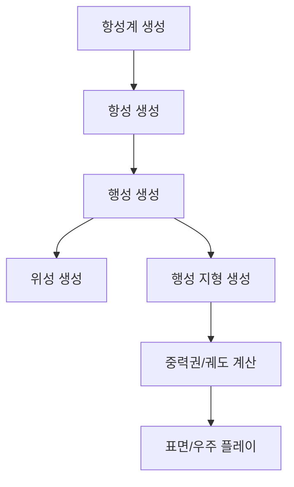

# StarRovers

업데이트: 2026-05-14

## 1. 문서 개요

이 문서는 StarRovers 프로젝트를 이어서 작업할 때 필요한 기준 문서다. 새 세션의 AI는 작업을 시작하기 전에 이 문서를 목차 순서대로 읽고, 현재 구조와 작업 규칙을 먼저 파악해야 한다.

StarRovers는 Unreal Engine 기반의 2.5D 태양계 경영 게임이다. 플레이어는 항성계 안에서 행성, 위성, 우주선, 자원, 거주지, 궤도 시설을 관리한다. 장기적으로는 절차적 행성 지형 생성, 중력권, 궤도, 표면 활동, 우주 항행이 자연스럽게 연결되는 구조를 목표로 한다.

## 2. 이 문서를 읽고 AI가 해야 하는 일

AI는 작업 전 다음 순서로 현재 상태를 확인한다.

1. README.md 전체를 목차 순서대로 읽는다.
2. 사용자가 지시한 대상 파일과 관련 클래스만 추가로 확인한다.
3. 기존 구조를 임의로 추측하지 않고, 코드와 에셋 상태를 기준으로 말한다.
4. `.uasset`은 텍스트처럼 직접 수정하지 않는다.
5. 빌드, 에디터 실행, PIE 실행은 사용자가 요청한 경우에만 진행한다.

답변할 때는 현재 구현과 목표 구조를 구분해서 말한다. 아직 옮기지 않은 기능을 이미 옮긴 것처럼 말하지 않는다.

## 3. 궁극적으로 개발해야 하는 것

StarRovers의 핵심 목표는 다음과 같다.

1. 항성, 행성, 위성의 데이터 기반 생성
2. 행성 지형의 랜덤 절차 생성
3. 중력권과 궤도 기반 우주 항행
4. 행성 표면과 우주 공간을 오가는 2.5D 플레이
5. 장기적인 태양계 단위 경영 시뮬레이션

현재는 행성 지형 Random 생성 기능을 본격 개발하기 전에, 항성/행성/위성의 Blueprint, C++ 클래스, Data Asset 필드와 컴포넌트 구조를 정리하는 단계다.

## 4. 전체적인 구조

### 4.1 게임 흐름

### 4.2 천체 구조 방향

천체 구조는 공통 Actor에 모든 기능을 몰아넣고 0 또는 Null 값으로 끄는 방식보다, 공통 정체성과 공통 컴포넌트만 부모에 두고 항성/행성/위성 전용 기능은 각 타입의 BP 또는 전용 컴포넌트로 분리하는 방향을 따른다.

현재 C++ 기반 공통 Actor는 `ASRCelestialBody`다. 이전 이름은 `AProceduralCelestialBody`였으며, Blueprint 에셋은 `BP_CelestialBodyType`에서 `BP_CelestialBody`로 정리했다.

`BP_CelestialBody`에 남길 공통 컴포넌트는 다음과 같다.

- `CelestialBodyStaticMesh`: 천체의 기본 시각 메시. C++에서는 Data Asset에서 전달되는 Static Mesh 에셋 필드를 `CelestialBodyStaticMesh`로 두고, 컴포넌트 포인터는 이름 충돌을 피하기 위해 `CelestialBodyStaticMesh_`로 둔다.
- `ClickSphereCollision`: 클릭/선택 판정용 독립 Sphere Collision
- `GravityParent`: 중력 부모로 작동하는 컴포넌트
- `Gravity Line Batch`: `GravityParent` 내부에서 중력권 라인 표시를 담당하는 런타임 보조 컴포넌트

다음 기능은 공통 `BP_CelestialBody`에서 제거하고, 필요한 천체 타입 쪽으로 옮기는 방향이다.

- `ShadowCaster`
- `Ocean`
- `ProceduralTerrain`
- `Orbit`

`BP_Star`는 `ASRStar`를 부모로 두고, 항성 전용 동작을 담당한다. `ASRStar`는 `ASRCelestialBody`를 상속하며 Native `StarPointLight`를 가진다. `BP_Star`의 `Star Rovers|Star` 항목에 노출되던 필드는 노출하지 않고, Star Data Asset의 `Star` 항목에서 받은 `StarMaterialEmissiveStrength`, `StarPointLightIntensity`, `StarPointLightColor` 값을 적용한다. 기존 `BP_Star`에 SCS 컴포넌트로 저장된 `StarPointLight`가 남아 있으면 부모를 `ASRStar`로 바꾼 뒤 에디터에서 중복 컴포넌트를 정리해야 한다.

`BP_Planet`은 행성과 위성이 함께 사용하는 단일 Blueprint Class로 정리한다. C++ 부모 클래스는 `ASRPlanet`이며, 공통 `BP_CelestialBody` 기능에 더해 `Orbit`, `Cast Shadow Static Mesh`, `Ocean Static Mesh`, `SurfaceGrid` 컴포넌트를 Native 컴포넌트로 가진다. 표면 그리드 C++ 컴포넌트 타입은 현재 `USRPlanetSurfaceGrid`다. 행성과 위성의 차이는 별도 Moon Blueprint Class가 아니라 Data Asset 수치와 `BodyCategory` 값으로 구분한다. Planet/Moon nameplate 이름은 생성 시 Data Asset의 `DisplayName`을 `BodySpec.DisplayName`으로 전달해서 표시한다. Moon DA는 Planet DA와 동일한 항목 구조를 사용하며 `BodyCategory` 기본값만 Moon으로 둔다.

`BP_Planet(Self)`의 `Star Rovers` 항목에는 Planet 전용 `Surface`, `Orbit`과 `BP_CelestialBody`에서 상속받은 `Gravity`, `Focus`, `Generation Seed`를 노출한다. `Surface` 하위에는 `Construction Height Offset`, `Grid Line Color`, `Grid Line Opacity`, `Grid Line Thickness`, `Hovered Cell Color`, `Selected Cell Color`, `Occupied Cell Color`를 남기며 `Construction Height Offset` 초기값은 `15`다. `Orbit` 하위에는 `Show Orbit Line`, `Orbit Line Color`, `Orbit Line Opacity`, `Orbit Line Thickness`만 남긴다. `Orbit` 컴포넌트의 Orbit Visual 값은 컴포넌트 Details에서 따로 편집하지 않고 Self의 `Orbit` 값과 Data Asset의 내부 수치를 받아 적용한다. `Orbit Speed`, Orbit line segment 수와 Shadow scale 수치는 `BP_Planet` Details가 아니라 Data Asset에서 조정한다.

Star Data Asset의 `Star Rovers` 항목 순서는 `Identity`, `Celestial Body`, `Gravity`, `Star`다. `Identity`에는 `Display Name`과 `Celestial Body Category`, `Celestial Body`에는 `Scale`, `Body Mesh`, `Material`, `Gravity`에는 `Mass`, `Gravity Ratio`, `Gravity Radius Ratio`, `Star`에는 `Star Material Emissive Strength`, `Star Point Light Intensity`, `Star Point Light Color`를 둔다. Star DA의 runtime spec은 이 전용 필드에서 생성한다.

Planet/Moon Data Asset의 `Star Rovers` 항목 순서는 `Identity`, `Celestial Body`, `Gravity`, `Orbit`, `Surface`, `Cast Shadow`, `Ocean`이다. Planet DA와 Moon DA는 동일한 노출 항목을 사용하며, Moon DA는 `BodyCategory` 기본값만 Moon으로 둔다.

`Ocean`은 보이는 물 표면용 Static Mesh Component다. 현재 Ocean 값은 Data Asset에서 `bHasOcean`, `OceanMesh`, `OceanMaterial`, `OceanScaleMultiplier`만 받으며, `OceanScaleMultiplier` 초기값은 `0.97`이다. Ocean wave, color, opacity, sea level offset, Dynamic Ocean Material 기반 런타임 파라미터 갱신은 현재 사용하지 않는다.

공통 `BP_CelestialBody(Self)`의 `Star Rovers` 항목에는 `Gravity`의 `Show Gravity Line`, `Gravity Line Color`, `Gravity Line Opacity`, `Gravity Line Thickness`, `Gravity Line Segments`, `Focus`의 `Focus Zoom Multiplier`, `GenerationSeed`의 `Generation Seed`를 노출한다. `DefaultGravityLineThickness`는 사용하지 않는다. 그 외 수치 필드는 C++ 멤버로 유지하되 Details 패널에는 노출하지 않고, Data Asset에서 넘어온 spec 값을 적용하는 내부 상태로 취급한다. 에디터에 노출하지 않는 scalar/FText/enum 런타임 캐시는 `UPROPERTY` 필드로 유지하지 않고 일반 C++ 멤버로 둔다. UObject/Component 참조만 GC와 컴포넌트 관리를 위해 숨은 `UPROPERTY`로 남긴다. `GravityParent` 컴포넌트의 중력 값은 Self의 Gravity 항목 또는 Data Asset spec에서 복사되어 적용되는 내부 상태로 취급하며, 컴포넌트 자체 Details 패널에서 따로 편집하지 않는다. Surface Grid의 Face Resolution과 Planet Radius는 `CelestialBodyStaticMesh` 스케일에서 계산하며, grid cell 크기가 일정하게 유지되도록 Face Resolution을 자동 산출한다. Surface Grid는 collision trace로 표면을 다시 찾지 않고, 절차 지형과 동일한 height/normal 계산으로 grid line과 cell transform의 표면 위치를 정한다. Surface Grid의 rebuild/debug 표시 옵션은 내부 상태로 취급하고, grid line 표시는 Assembly Mode에서만 켜진다. Draw Debug Normals, Grid Subdivision, Normal Length는 Details 노출 항목으로 사용하지 않는다. `Cast Shadow Static Mesh`는 `CelestialBodyStaticMesh`와 동일한 mesh를 pivot 기준으로 축소해서 사용하며, 별도 Cast Shadow mesh/material 필드는 사용하지 않는다. Shadow scale은 Planet/Moon Data Asset에서 다루고 내부적으로 `Cast Shadow Static Mesh`에 적용된다. C++ 코드는 `CelestialBodyStaticMesh_`, `CastShadowStaticMesh`, `OceanStaticMesh`, `StarPointLight`의 Cast Shadow 값을 강제로 수정하지 않는다. Orbit Visual 중 표시 여부, 색, 투명도, 두께는 `ASRPlanet`/`BP_Planet(Self)`의 `Orbit`에서 다루고, segment 수와 실제 궤도 운동 수치는 Data Asset 또는 generator spec에서 넘어온 내부 상태로 취급한다. `Default Surface Body Material`과 `Apply Preview in Editor` 기반 자동 preview 기능은 사용하지 않는다.

C++에서 공통 생성자에서 제거한 Native 컴포넌트는 사용자가 빌드 후 에디터를 다시 열면 inherited component로 새로 생성되지 않아야 한다. 다만 기존 Blueprint에 SCS 컴포넌트로 저장된 항목은 에디터에서 직접 삭제해야 할 수 있다.
항성 Blueprint 에셋 이름은 `BP_Star`만 사용한다. 이전 항성 Blueprint 이름 참조는 사용하지 않는다.

## 5. 현재 작업 상태

### 5.1 중력 구조

중력 제공 역할은 기존 `UStarRoversGravitySourceComponent`에서 `USRGravityParent`로 정리 중이다. 이름은 Source보다 Parent를 사용한다. 이유는 이 컴포넌트가 단순히 힘을 내는 물체라는 의미보다, 자식 천체나 영향을 받는 객체가 기준으로 삼는 중력 부모 역할에 가깝기 때문이다.

중력을 받는 쪽은 별도의 Child 계열 컴포넌트로 관리한다. 현재 프로젝트에는 `USRGravityChild`가 존재한다.

### 5.2 최근 리팩터링 기준

최근 정리한 이름과 방향은 다음과 같다.

- `GravitySourceComponent` -> `GravityParent`
- `UStarRoversGravitySourceComponent` -> `USRGravityParent`
- `GravityFieldLineBatcher` -> `Gravity Line Batch`
- `CelestialBodyMesh` -> `CelestialBodyStaticMesh`
- `CelestialBodyStaticMeshAsset` -> `CelestialBodyStaticMesh`
- `CelestialBodyStaticMeshComponent` -> `CelestialBodyStaticMesh_`
- `DefaultGravityLineThickness` 제거
- `ClickCollision` -> `ClickSphereCollision`
- `BP_CelestialBodyType` -> `BP_CelestialBody`
- `BP_PlanetBody` / `BP_MoonBody` -> `BP_Planet`
- 항성 Blueprint 이름은 `BP_Star`만 사용
- 항성 Point Light 이름은 `StarPointLight`만 사용
- `USRCelestialRegistrySubsystem` -> `USRCelestialBodyRegistrySubsystem`
- `USRTimeSubsystem` -> `USRTimeControlSubsystem`
- `USRStarMapBodyFocusPanelWidget` -> `USRCelestialBodyFocusInfoWidget`
- `USRCelestialBodyFocusInfoPanelWidget` -> `USRCelestialBodyFocusInfoWidget`
- `USRStarMapCelestialOverviewEntryAction` -> `USRCelestialBodyOverviewEntryAction`
- `USRStarMapCelestialOverviewWidget` -> `USRCelestialBodyOverviewWidget`
- `USRStarMapTimeControlWidget` -> `USRTimeControlWidget`
- `USRPlanetSurfaceGridComponent` -> `USRPlanetSurfaceGrid`
- `ASRStarMapCameraPawn` -> `ASRCameraPawn`
- `ASRStarMapPlayerController` -> `ASRPlayerController`
- `ASRStarMapGameMode` -> `ASRGameMode`
- `FSRScreenSpaceLineUtils` -> `FSRLineThicknessUtils`
- `FSRCelestialBiomeSpec` -> `FSRCelestialBodyBiomeSpec`
- `FSRPlanetSurfaceCellId` -> `FSRPlanetSurfaceGridCellId`
- `FSRPlanetSurfaceCellNeighbors` -> `FSRPlanetSurfaceGridCellNeighbors`
- `FSRPlanetSurfaceCell` -> `FSRPlanetSurfaceGridCell`
- `FSRStarMapCelestialNameplateLayout` -> `FSRCelestialBodyOverviewNameplateLayout`
- `FSRGeneratedCelestialBodyRequest` -> `FSRCelestialBodyGenerateRequest`
- `FSRViewFrustumSnapshot` -> `FSRCameraInfo`
- `FSROrbitPackingItem` -> `FSROrbitInfo`
- `GetSurfaceGridComponent` -> `GetSurfaceGrid`
- `FindPlanetSurfaceGridComponent` -> `FindPlanetSurfaceGrid`
- `GetFocusPanelWidget` -> `GetFocusInfoWidget`
- `TryBuildPrimaryViewFrustumSnapshot` -> `TryBuildPrimaryCameraInfo`
- `BP_SRCameraPawn`, `BP_SRPlayerController`, `BP_SolarSystemGenerator`의 C++ 부모 클래스 내부 함수/변수명은 에디터에 노출되는 Field 이름 기준으로 정리했다.
- `CastShadowStaticMesh`, `OceanStaticMesh`, `StarPointLight`에 대한 C++ Cast Shadow 강제 설정 코드는 제거했다.

C++ 클래스/프로퍼티 리다이렉트는 현재 사용하지 않는다. 이름 변경 후 `.uasset` 내부 참조 상태는 에디터에서 확인한다.

현재 코드에는 `ASRPlanet`이 추가되어 있으며, `ASRSolarSystemGenerator`의 행성/위성 기본 Blueprint 경로는 모두 `BP_Planet`을 사용한다. `ASRSolarSystemGenerator`는 게임 월드 `BeginPlay`에서 항상 `GenerateRuntimeSystem()`을 호출하므로 별도의 자동 생성 On/Off 옵션을 두지 않는다. Details 패널에서는 `Star Rovers` 아래에 `Generation Seed`, `Celestial Body Class`, `Celestial Body Data Assets`, `Celestial Body Count`, `Orbit` 생성 설정을 노출한다. 행성/위성 생성 개수는 Data Asset이 아니라 generator의 `MinPlanet`, `MaxPlanet`, `MinMoon`, `MaxMoon`에서 결정한다. 생성기는 랜덤으로 선택된 Star/Planet/Moon Data Asset에 필수 spec, mesh, material, display name이 없으면 fallback 후보로 대체하지 않고 Error를 기록한 뒤 해당 생성 과정을 중단한다. 궤도 packing이 부모 중력 반경에 맞지 않는 경우에도 후보 수를 줄여 재시도하지 않고 Error를 기록한다. 다만 기존 Blueprint 에셋의 부모 클래스 변경과 남아 있는 SCS 컴포넌트 정리는 에디터에서 확인해야 한다.

`ASRCameraPawn`은 `SpringArm`의 `TargetArmLength`로 zoom을 제어한다. 카메라가 `BP_Space`의 Space Static Mesh 밖으로 나가지 않도록, 런타임에 `BP_Space` 후보 Actor의 PrimitiveComponent bounds를 읽어 Space sphere 중심과 반지름을 구하고, Spring Arm 방향과 현재 Pawn 위치를 기준으로 최대 zoom 길이와 drag/focus pivot 위치를 함께 제한한다. `SpringArm`의 collision test는 사용하지 않는다.

`ASRPlanet`의 Details 노출은 `Surface`의 `Construction Height Offset`, `Grid Line Color`, `Grid Line Opacity`, `Grid Line Thickness`, `Hovered Cell Color`, `Selected Cell Color`, `Occupied Cell Color`와 `Orbit`의 `Show Orbit Line`, `Orbit Line Color`, `Orbit Line Opacity`, `Orbit Line Thickness`, `Orbit Line Segments`로 제한한다. `USROrbit` 컴포넌트의 Orbit Visual UPROPERTY는 Details 편집 대상에서 제외하고, `ASRPlanet`이 Self/Data Asset에서 정리된 값을 전달한다. `USRPlanetSurfaceGrid` 컴포넌트의 Face Resolution, Planet Radius, Rebuild Grid On Register, Debug Grid 표시 옵션, Draw Debug Normals, Grid Subdivision, Normal Length, Terrain 수치는 Details 편집 대상에서 제외한다. Shadow Scale과 Orbit Speed는 `FSRCelestialBodyBiomeSpec`에 포함되어 Planet/Moon Data Asset에서 조정한다. `USRPlanetDataAsset`과 `USRMoonDataAsset`은 동일한 노출 항목을 사용하며, 생성기는 두 타입 모두 `BuildBiomeSpec()`와 Scale/Mass/Gravity 값을 통해 spec을 구성한다.

### 5.3 현재 BP/DA 에셋 상태

현재 파일 기준으로 확인된 Blueprint Class 에셋은 다음과 같다.

- `Content/BlueprintClasses/CelestialBody/BP_CelestialBody.uasset`
- `Content/BlueprintClasses/CelestialBody/BP_Planet.uasset`
- `Content/BlueprintClasses/CelestialBody/BP_Space.uasset`
- `Content/BlueprintClasses/CelestialBody/BP_Star.uasset`
- `Content/BlueprintClasses/Core/BP_SRCameraPawn.uasset`
- `Content/BlueprintClasses/Core/BP_SRGameMode.uasset`
- `Content/BlueprintClasses/Core/BP_SRPlayerController.uasset`
- `Content/BlueprintClasses/Generator/BP_SolarSystemGenerator.uasset`
- `Content/BlueprintClasses/UI/WBP_FocusInfo.uasset`
- `Content/BlueprintClasses/UI/WBP_Overview.uasset`
- `Content/BlueprintClasses/UI/WBP_TimeControl.uasset`

현재 파일 기준으로 확인된 Data Asset 에셋은 다음과 같다.

- `Content/BlueprintClasses/CelestialBody/DA_Star_MainSequenceStar.uasset`
- `Content/BlueprintClasses/CelestialBody/DA_Planet_LavaOcean.uasset`
- `Content/BlueprintClasses/CelestialBody/DA_Moon_BadLands.uasset`

추가로 현재 파일 기준으로 확인된 주요 에셋은 다음과 같다.

- `Content/BlueprintClasses/Core/IA_DragDelta.uasset`
- `Content/BlueprintClasses/Core/IA_DragHold.uasset`
- `Content/BlueprintClasses/Core/IA_FocusParent.uasset`
- `Content/BlueprintClasses/Core/IA_LeftClick.uasset`
- `Content/BlueprintClasses/Core/IA_Zoom.uasset`
- `Content/BlueprintClasses/Core/IMC_SR.uasset`
- `Content/Levels/SolarSystem.umap`
- `Content/Materials/M_Normal.uasset`
- `Content/Materials/M_Space.uasset`
- `Content/Materials/M_Star.uasset`
- `Content/Externals/Space/T_Space.uasset`
- `Content/Externals/Space/T_SpaceSky_SolarSystemScope_8K.jpg`

위 BP/DA/WBP의 실제 부모 클래스와 Data Asset 타입은 에디터에서 확인해야 한다. 최근 C++ 이름 변경에 대한 리다이렉트는 두지 않으므로, `.uasset` 내부 저장 상태와 SCS 컴포넌트 중복 여부는 에디터에서 직접 확인한다.

### 5.4 행성 지형 생성

행성 지형 Random 생성 기능은 아직 본격 개발 전 단계다. 먼저 항성, 행성, 위성의 Blueprint와 Data Asset 필드 구조를 정리한 뒤 진행한다.

주요 점검 대상은 다음과 같다.

- `BP_CelestialBody`
- `BP_Star`
- `BP_Planet`
- `DA_Star_MainSequenceStar`
- `DA_Planet_LavaOcean`
- `DA_Moon_BadLands`

## 6. 설계 원칙

1. 부모 클래스에는 모든 천체가 실제로 공유하는 정체성과 최소 공통 컴포넌트만 둔다.
2. 항성 전용 기능은 항성 BP 또는 항성 전용 컴포넌트에 둔다.
3. 행성 전용 기능은 행성 BP 또는 행성 전용 컴포넌트에 둔다.
4. 위성 전용 기능은 위성 BP 또는 위성 전용 컴포넌트에 둔다.
5. Data Asset은 수치를 담고, Actor/Component는 동작을 담당한다.
6. 값을 0 또는 Null로 둬서 기능을 끄는 방식은 임시 호환에는 쓸 수 있지만 장기 구조의 기본값으로 삼지 않는다.

## 7. 작업 규칙

### 7.1 코드 작업

- 변경 전 관련 파일을 먼저 읽는다.
- `rg`를 우선 사용해서 참조를 찾는다.
- 수동 코드 수정은 가능한 한 `apply_patch`를 사용한다.
- 단, 파일 인코딩이 깨져 패치 도구가 읽지 못하는 경우에는 UTF-8로 안전하게 복구한다.
- 사용자 변경을 임의로 되돌리지 않는다.
- 빌드는 사용자가 요청한 경우에만 실행한다.

### 7.2 Unreal 에셋 작업

- `.uasset` 파일을 텍스트 파일처럼 직접 편집하지 않는다.
- Blueprint에 저장된 SCS 컴포넌트 삭제, 부모 클래스 변경, Data Asset 값 수정은 에디터에서 확인한다.
- C++ Native 컴포넌트를 제거해도 기존 Blueprint에 저장된 컴포넌트가 남아 있으면 에디터에서 직접 정리해야 할 수 있다.

### 7.3 Naming 규칙

C++ 클래스 이름은 기본적으로 `종류 접두어 + 프로젝트 Prefix + 기능` 형태를 사용한다.

프로젝트 Prefix는 `SR`이다.

Unreal C++ 접두어는 엔진 관례를 따른다.

- `A`: Actor
- `U`: UObject, Component, Data Asset, Subsystem 등 UObject 기반 타입
- `F`: Struct
- `E`: Enum
- `I`: Interface

예시는 다음과 같다.

- `AProceduralCelestialBody` -> `ASRCelestialBody`
- `UStarRoversGravitySourceComponent` -> `USRGravityParent`
- `FProceduralCelestialBodySpec` -> `FSRCelestialBodySpec`
- `FProceduralCelestialBiomeSpec` -> `FSRCelestialBodyBiomeSpec`
- `UStarRoversGravityReceiverComponent` -> `USRGravityChild`
- `UStarRoversOrbitComponent` -> `USROrbit`
- `UStarRoversTimeSubsystem` -> `USRTimeControlSubsystem`
- `ASolarSystemGenerator` -> `ASRSolarSystemGenerator`
- `UPlanetDataAsset` -> `USRPlanetDataAsset`
- `UMoonDataAsset` -> `USRMoonDataAsset`
- `UStarPresetDataAsset` -> `USRStarDataAsset`
- `ECelestialBodyCategory` -> `ESRCelestialBodyCategory`

에디터에서 보이는 에셋 이름은 Unreal 프로젝트 관례 접두어를 사용한다.

- `BP_`: Blueprint Class
- `DA_`: Data Asset
- `WBP_`: Widget Blueprint
- `M_`: Material
- `MI_`: Material Instance
- `T_`: Texture
- `SM_`: Static Mesh

Blueprint와 Data Asset 에셋은 예를 들어 `BP_CelestialBody`, `BP_Star`, `DA_Planet_LavaOcean`처럼 쓴다.

### 7.4 Git 규칙

- `.gitattributes`로 텍스트 파일의 줄바꿈은 LF로 고정한다.
- `.uasset`, `.umap`과 이미지/오디오/압축/3D 에셋은 binary로 취급한다.
- `Binaries/`, `Intermediate/`, `Saved/`, `DerivedDataCache/`, `.vs/`, `.sln`은 `.gitignore`로 제외한다.
- 커밋 전 줄바꿈 정책을 반영해야 할 때는 `git add --renormalize .`를 실행한 뒤 `git add .`와 `git status`로 확인한다.

## 8. README 업데이트 규칙

README.md는 작업 기준 문서이므로 구조 변경이 있을 때 함께 갱신한다.

업데이트 시 지켜야 할 규칙은 다음과 같다.

1. 실제 코드/에셋 상태와 목표 구조를 구분해서 기록한다.
2. 이미 완료된 변경과 아직 에디터에서 확인해야 하는 변경을 구분한다.
3. 이름 변경이 있으면 이전 이름과 새 이름을 함께 적는다.
4. 사용자가 빌드하지 말라고 한 경우 빌드 결과를 기록하지 않는다.
5. 인코딩은 UTF-8로 유지한다.
