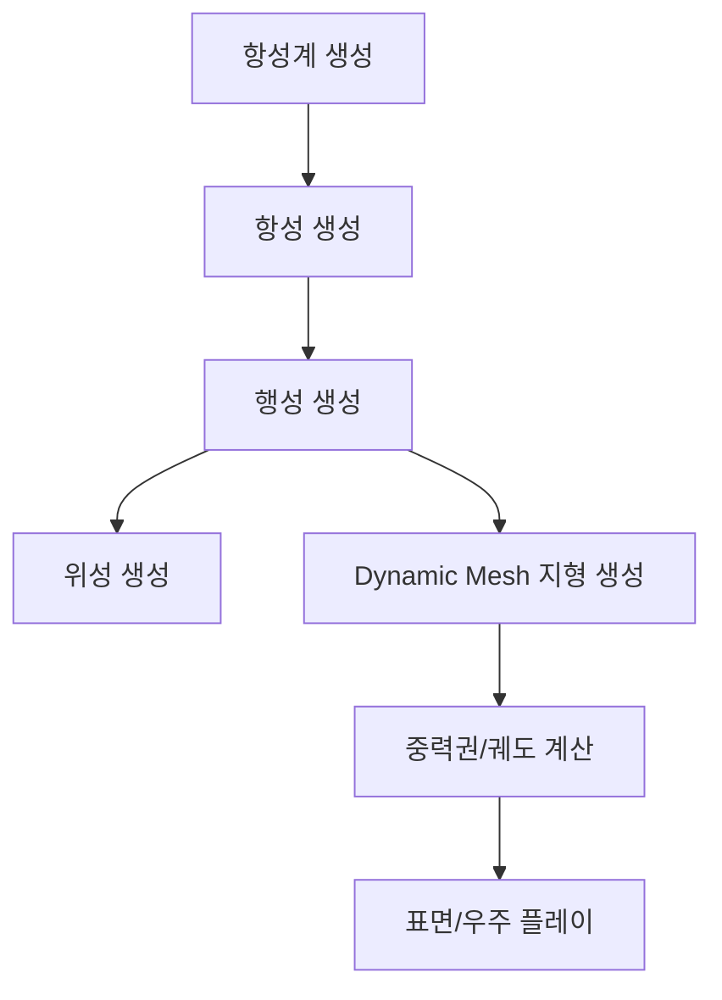

# StarRovers

업데이트: 2026-06-04

## 1. 문서 개요

StarRovers는 Unreal Engine 기반의 2.5D 태양계 경영 게임이다. 플레이어는 항성계 안에서 행성, 위성, 우주선, 자원, 거주지, 궤도 시설을 관리한다.

이 문서는 새 세션의 AI가 작업 전 읽어야 하는 기준 문서다. 실제 코드/에셋 상태와 목표 구조를 구분해서 다루며, `.uasset`은 텍스트처럼 직접 수정하지 않는다.

## 2. 작업 전 확인 순서

1. README.md를 목차 순서대로 읽는다.
2. 사용자가 지시한 대상과 관련 클래스만 추가로 확인한다.
3. 코드와 에셋 상태를 기준으로 말하고, 구현되지 않은 목표를 완료된 것처럼 말하지 않는다.
4. 빌드, 에디터 실행, PIE 실행은 사용자가 요청한 경우에만 진행한다.

## 3. 목표

장기 목표는 데이터 기반 항성/행성/위성 생성, 절차적 행성 지형, 중력권과 궤도 기반 우주 항행, 행성 표면과 우주 공간을 오가는 2.5D 플레이, 태양계 단위 경영 시뮬레이션이다.

현재는 항성/행성/위성의 C++ 클래스, Blueprint, Data Asset, 컴포넌트 구조를 정리하면서 Dynamic Mesh 기반 행성 지형 생성을 확장하는 단계다.

## 4. 현재 구조

### 4.1 게임 흐름

```mermaid
flowchart TD
    Start[항성계 생성] --> Star[항성 생성]
    Star --> Planets[행성 생성]
    Planets --> Moons[위성 생성]
    Planets --> Terrain[Dynamic Mesh 지형 생성]
    Terrain --> Gravity[중력권/궤도 계산]
    Gravity --> Gameplay[표면/우주 플레이]
```

### 4.2 천체 클래스

- 공통 천체 Actor는 `ASRCelestialBody` / `BP_CelestialBody`다.
- 항성은 `ASRStar` / `BP_Star`를 사용한다.
- 행성과 위성은 모두 `ASRPlanet` / `BP_Planet`을 사용하고, 차이는 Data Asset 수치와 `BodyCategory`로 구분한다.
- Moon 전용 Blueprint Class는 사용하지 않는다.

`BP_CelestialBody`의 공통 Native 컴포넌트는 `CelestialBodyStaticMesh`, `CelestialBodyDynamicMesh`, `ClickSphereCollision`, `GravityParent`, `GravityLineBatch`다. `Ocean`, `ProceduralTerrain`, `Orbit`은 공통 BP가 아니라 필요한 타입 쪽에서 다룬다.

`ASRPlanet`은 `Orbit`, `OceanStaticMesh`, `AtmosphereStaticMesh`, `SurfaceGrid`, `ConveyorNetwork`, `StructureInstanceManager`, `RotationAxisNorthSpline`, `RotationAxisSouthSpline`을 Native 컴포넌트로 가진다. 자전축 표시는 local +Z/-Z 극점 바깥쪽 두 개의 `USplineMeshComponent` 세그먼트로 구성하며, 표면 내부 선분은 만들지 않아 body surface depth에 자연스럽게 가려진다. 축 mesh는 기본 엔진 Cylinder를 사용하고, 자전축 선은 screen-space thickness 기준을 사용해 zoom/FOV에 적응하며, `StarRovers|Axis`에서 표시 여부, 색, opacity, thickness, 길이 multiplier, spline mesh, material을 정한다. `SurfaceGrid` 타입은 `USRPlanetSurfaceGrid`다. `ConveyorNetwork` 타입은 `USRConveyorNetworkComponent`이며, Surface Grid cell 위 conveyor segment를 `CellId + Layer` 단위로 보관하고 Conveyor DA/layer 단위로 묶은 `ASRConveyorBeltActor`의 PCG spline mesh로 표시한다. `StructureInstanceManager` 타입은 `USRStructureInstanceManagerComponent`이며, 일반 구조물은 기본적으로 Actor를 spawn하지 않고 mesh/material 조합별 `UHierarchicalInstancedStaticMeshComponent` instance로 표시한다. 현재 `SurfaceGrid` 활성화는 `BodyCategory == Planet`일 때만 허용하므로, Moon은 Dynamic Mesh terrain은 생성될 수 있지만 표면 grid는 숨겨진다.

### 4.3 Data Asset 항목

Star Data Asset의 `Star Rovers` 항목은 `Identity`, `CelestialBody`, `Gravity`, `Star`다.

- `Identity`: `VariableName`, `BodyCategory`
- `CelestialBody`: `Scale`, `StaticMesh`, `Material`
- `Gravity`: `Mass`, `GravityRatio`, `GravityRadiusRatio`
- `Star`: `StarPointLightIntensity`, `StarPointLightColor`

Star Material의 emissive scalar 값은 Material 또는 Material Instance에 저장된 값을 그대로 사용한다. C++는 `Emissive Strength`, `EmissiveStrength`, `GlowIntensity`, `Glow`, `Intensity`, `Brightness` 같은 scalar parameter를 덮어쓰지 않는다.

Planet/Moon Data Asset의 `Star Rovers` 항목은 `Identity`, `CelestialBody`, `Gravity`, `Orbit`, `Surface`, `Dynamic Mesh Generation`, `Ocean`, `Atmosphere`다. `Surface`에는 `SurfaceGridHeightOffset`을 둔다. 구조물 배치 높이는 Planet/Moon DA가 아니라 Structure DA의 `ConstructionHeightOffset`만 사용한다. `Dynamic Mesh Generation`에는 `bMinecraft`를 포함한 `FSRDynamicMeshGeneration` 값을 직접 노출하고, 선택적으로 `TerrainProfileDataAsset`을 참조한다. Planet/Moon DA는 가장 큰 설정 단위로 Profile 선택, biome material, Profile 단 자연 생성 구조물 수치 override를 가진다. `TerrainProfileDataAsset`은 Biome DA 목록과 Profile 단 자연 생성 구조물 규칙을 제공한다. Terrain Generator는 DA로 선택하지 않으며 코드에 하나만 존재한다. Biome material은 같은 Biome이라도 Planet/Moon마다 다를 수 있으므로 Profile이나 Biome DA가 아니라 Planet/Moon DA의 `BiomeMaterials`에 둔다. `BiomeMaterials`는 선택된 Profile의 Biome DA 목록에 따라 정규화된다. `AtmosphereThreshold`는 `OceanThreshold` 바로 아래에 두며 `AtmosphereStaticMesh`의 body radius 대비 크기를 정한다. `bMinecraft`가 true이면 Dynamic Mesh와 Surface Grid 높이를 일반 cube-face subdivision 한 칸의 edge 길이 단위로 계단화하고, false이면 terrain sample의 높이 값을 그대로 사용한다.

### 4.4 Generator와 Camera

`ASRSolarSystemGenerator`는 게임 월드 `BeginPlay`에서 `GenerateRuntimeSystem()`을 호출한다. 별도 자동 생성 On/Off 옵션은 두지 않는다. 행성/위성 생성 개수는 Data Asset이 아니라 generator의 `MinPlanet`, `MaxPlanet`, `MinMoon`, `MaxMoon`에서 결정한다.

생성기는 랜덤 선택된 Star/Planet/Moon Data Asset에 필수 spec, mesh, material, `VariableName`이 없으면 fallback 후보로 대체하지 않고 Error를 기록한 뒤 해당 생성 과정을 중단한다. 궤도 packing이 부모 중력 반경에 맞지 않는 경우에도 후보 수를 줄여 재시도하지 않고 Error를 기록한다.

`ASRSolarSystemGenerator`는 `bGenerateNaturalStructures`가 true일 때 Dynamic Mesh와 Surface Grid cache 준비가 끝난 뒤 Planet Surface Grid 위에 자연 생성 구조물을 배치한다. Planet/Moon DA에서 전달된 `TerrainProfileDataAsset`의 `ProfileNaturalStructureSpawnRules`를 전체 cell 후보에 적용하며, Planet/Moon DA의 `ProfileNaturalStructureSpawnRuleOverrides`가 같은 `RuleId`의 수치값을 덮어쓸 수 있다. 이어서 Profile의 `Biomes`에 들어 있는 각 `USRPlanetBiomeDataAsset`의 `NaturalStructureSpawnRules`를 cell biome별 후보에 적용하며, Profile의 Biome entry가 같은 `RuleId`의 수치값을 덮어쓸 수 있다. Generator Actor에는 더 이상 전역 자연 구조물 fallback 규칙을 두지 않는다. 각 규칙은 `StructureDataAsset`, `SpawnChancePerCell`, `MaxCount`, `MinCellSpacing`을 사용한다. `MaxCount`가 0이면 해당 규칙의 개수 제한을 두지 않는다.

`ASRCameraPawn`은 camera pawn 위치를 camera pivot으로 사용하고 `SpringArm.TargetArmLength`로 zoom을 제어한다. `BP_Space`의 PrimitiveComponent bounds를 기준으로 pivot 위치와 camera endpoint zoom 거리를 제한하며, non-star 천체 관통 방지는 `SpringArm` collision test와 C++ camera avoidance sphere 보정을 함께 사용한다. SpringArm probe는 `ECC_Camera`를 사용하고, 천체 클릭용 `ClickSphereCollision`은 `ECC_Visibility`만 block하며 `ECC_Camera`는 ignore한다. Star actor는 C++ avoidance sphere 대상에서 제외하고 visual mesh collision을 끈다.

`IA_LeftClick` 기반 Left Click drag는 현재 camera forward를 법선으로 하는 drag 시작 pivot 평면에서 camera rotation이 반영된 screen-space 방향으로 pivot을 자유 XYZ 이동한다. Left Click drag와 Right Click surface drag는 zoom/FOV 변화에 맞춘 `GetScreenSpaceInputScale()`을 사용해 zoom input과 같은 기준으로 적응형 동작한다. 기본 screen-space scale `x = CurrentZoomDistance * tan(CurrentFOV / 2) / (ReferenceZoomDistance * tan(ReferenceFOV / 2))`에 입력별 multiplier를 적용한다. Zoom은 `ZoomInputScaleMultiplier`, Left Click drag는 `LeftDragInputScaleMultiplier`, Right Click drag는 `RightDragInputScaleMultiplier`를 사용하며, Right Click drag는 `RightDragInputScaleMax`가 0보다 클 때 최종 scale을 해당 값으로 제한한다. Focused 천체에서 `DragHoldAction` 기반 Right Click surface drag를 시작하면 천체 Actor를 직접 회전하지 않고 `FocusSurfaceRotation` quaternion을 즉시 조정해 표면을 훑는 camera surface control을 수행한다. drag 중 계산된 각속도는 release 이후 관성으로 이어지며 `FocusSurfaceInertiaDamping`으로 감쇠하고, 관성도 target smoothing 없이 `FocusSurfaceRotation`에 직접 반영된다. `IA_FocusSurface` 기반 IJKL 입력은 `FocusSurfaceInputAcceleration`/`FocusSurfaceInputDeceleration`으로 가속/감속된 입력값을 사용해 같은 `FocusSurfaceRotation`을 직접 제어한다. 자동 grid roll 보정은 하지 않는다. `IA_AlignFocusSurfaceGrid` 기반 수동 정렬 입력을 누르면 camera center ray를 focused body의 `SurfaceGrid`에 raycast해 맞은 cell을 찾고, side face에 맞은 경우에도 해당 side face를 소유한 cell을 기준으로 한다. hit cell의 U/V 축을 화면 평면에 투영한 네 방향 후보 중 가장 적게 rotate해 맞출 수 있는 방향을 골라 `FocusSurfaceTargetRotation`에 반영한다. 이 수동 정렬과 focus reset처럼 명시적 target이 있는 경우에만 실제 `FocusSurfaceRotation`이 `FocusFollowSmoothTime` 기준 `SmoothDampQuat`으로 target을 따라간다.

현재 Static/Dynamic Mesh 전환 로직은 `ASRCameraPawn::ShouldUseDynamicMesh()`와 `ApplyCelestialBodyMeshVisibility()`에 있다. focused actor는 frustum 안에 있을 때 Dynamic Mesh 후보가 되고, non-focused actor는 카메라 앞/frustum 조건을 만족하면서 화면 점유율이 0.15 이상일 때만 후보가 된다. 한 프레임에서 실제 Dynamic Mesh로 전환되는 대상은 focused planet 또는 가장 크게 보이는 non-focused planet 하나다.

## 5. Dynamic Mesh Generation

### 5.1 설정 위치

Planet/Moon Data Asset의 `Dynamic Mesh Generation` 항목은 `FSRDynamicMeshGeneration` struct를 직접 노출하고, 별도 `TerrainProfileDataAsset` 참조를 가진다.

주요 값은 다음과 같다.

- `bDynamicMeshGeneration`
- `bMinecraft`
- `BiomeMaterials`
- `ProfileNaturalStructureSpawnRuleOverrides`
- `GenerationSeed`
- `bRandomizeGenerationSeedEachRun`
- `DynamicMeshHeight`
- `OceanThreshold`
- `AtmosphereThreshold`
- `ContinentFrequency`
- `MountainFrequency`
- `MountainStrength`
- `ValleyStrength`
- `RiverStrength`
- `LakeStrength`
- `TemperatureFrequency`
- `MoistureFrequency`
- `DetailFrequency`
- `DetailStrength`
- `NoiseStrength`
- `NoiseOctaves`
- `NoisePersistence`

각 필드의 의미는 다음과 같다. `bDynamicMeshGeneration`은 절차 지형 생성 On/Off이고, `bMinecraft`는 높이를 일반 cube-face subdivision 한 칸의 edge 길이 단위 계단형으로 끊을지 정한다. `BiomeMaterials`는 Profile의 Biome DA 순서에 맞는 material slot 목록이며, `GenerationSeed`는 같은 설정에서 같은 지형/biome 배치를 재현하는 seed다. `DynamicMeshHeight`는 전체 높낮이 스케일이라 키우면 산/골짜기/해저 높이 차가 커진다. `OceanThreshold`는 바다/육지 경계 보정값이며 키우면 바다 비중이 늘고 낮추면 육지가 늘어난다. `AtmosphereThreshold`는 body radius 대비 대기 mesh 배율이다. `ContinentFrequency`, `MountainFrequency`, `TemperatureFrequency`, `MoistureFrequency`, `DetailFrequency`는 각각 대륙, 산맥, 기온, 습도, 미세 기복 noise를 얼마나 촘촘하게 샘플할지 정하며, 값을 키우면 패턴이 더 잘게 쪼개진다. `MountainStrength`, `ValleyStrength`, `RiverStrength`, `LakeStrength`, `DetailStrength`는 각 효과가 최종 지형에 반영되는 강도다. `NoiseStrength`는 domain warp 강도라 키울수록 대륙선/산맥/기후 패턴이 더 불규칙하게 휘고, `NoiseOctaves`와 `NoisePersistence`는 fractal noise의 세밀함과 작은 패턴 영향 유지율을 정한다.

현재 C++ 생성자 기본값은 Planet DA와 Moon DA 모두 단일 terrain generator를 사용한다. Random 생성용 Planet/Moon DA에는 `TerrainProfileDataAsset`이 필수다. Profile이 없거나 Profile에 유효한 Biome DA가 없으면 fallback material/biome을 만들지 않고 Error를 기록한 뒤 해당 생성 요청을 실패 처리한다. `TerrainProfileDataAsset`이 있으면 `BuildData()`에서 해당 Profile의 Biome DA 목록에 맞춰 `BiomeMaterials` entry를 정규화한다. material 값 자체는 Planet/Moon DA에 남는다. 실제 저장 값은 에디터에서 다시 저장해 확인해야 한다.

### 5.2 생성 데이터 흐름

1. Planet/Moon Data Asset의 `BuildData()`가 `FSRDynamicMeshGeneration`을 `FSRCelestialBodyData.DynamicMeshGeneration`으로 복사하고, `TerrainProfileDataAsset`이 있으면 Profile의 Biome 목록에 맞춰 Planet/Moon DA의 biome material entry를 정규화한다.
2. `ASRSolarSystemGenerator`가 행성/위성 생성 요청을 만들 때 `GenerationSeed`를 랜덤으로 정하고, 같은 값을 `DynamicMeshGeneration.GenerationSeed`에 넣는다.
3. `ASRCelestialBody::SetData()`가 `DynamicMeshGeneration`과 `TerrainProfileDataAsset`을 Actor 내부 상태로 복사하고, Profile이 있으면 Profile의 Biome DA 목록과 terrain generator를 다시 적용한다.
4. `ASRCelestialBody::ApplyData()`가 `EnsureCelestialBodyDynamicMeshVisuals(false)` 경로로 Static Mesh와 Material을 검증한다.
5. `ASRPlanet::ApplyData()`는 같은 `DynamicMeshGeneration`을 `SurfaceGrid->ConfigureTerrain()`에도 넘긴다.
6. Runtime system 생성이 끝나면 `ASRSolarSystemGenerator::PrepareRuntimeGeneratedDynamicMeshes()`가 생성된 planet/moon 전체에 `PrepareCelestialBodyDynamicMesh()`를 호출해 Dynamic Mesh와 Grid cache를 시작 시점에 준비한다.
7. `ASRSolarSystemGenerator::GenerateRuntimeNaturalStructures()`가 Planet의 `TerrainProfileDataAsset`에 있는 Profile 단 규칙과 Profile이 포함한 Biome DA의 Biome 단 규칙을 기준으로 자연 생성 구조물을 배치한다.

### 5.3 Mesh 생성 방식

`CopyStaticMeshToCelestialBodyDynamicMesh()`는 Data Asset의 `CelestialBody > StaticMesh`에 지정된 Static Mesh의 LOD0 render data를 읽는다. vertex buffer, index buffer, normal, vertex color, material id를 기반으로 `UDynamicMeshComponent`에 들어갈 `FDynamicMesh3`를 만든다.

절차 지형 생성 경로는 다음 조건을 모두 만족할 때만 사용한다.

- `BodyCategory`가 `Planet` 또는 `Moon`
- `bDynamicMeshGeneration == true`
- `DynamicMeshHeight > 0`
- 원본 Static Mesh 삼각형을 사각형 cell로 복원할 수 있음

조건을 만족하면 원본 삼각형 두 개를 하나의 quad cell로 복원한다. 각 cell 중심 방향과 recovered cube face/cell 정보를 담은 `FSRBiomeSampleContext`를 기준으로 `FSRPlanetTerrainGenerator::SampleTerrain()`을 호출하고, 반환된 `HeightOffset`에 따라 cell 네 꼭짓점을 천체 중심 기준으로 scale up/down한다.

`bMinecraft`가 true이면 높이는 일반 cube-face subdivision 한 칸의 edge 길이 단위로 계단식 quantize된다. Dynamic Mesh 생성 시에는 복원된 face resolution과 source 반지름으로 `2 * SourceRadius / FaceResolution`을 계산하고, Surface Grid의 일반 terrain query는 `2 * PlanetRadius / FaceResolution`을 쓴다. false이면 sampler가 반환한 `HeightOffset`이 그대로 적용된다. 인접 cell 높이가 다르면 side wall face를 추가해 틈을 막는다. 각 surface quad와 side wall에는 vertex color가 기록되고, `BiomeMaterials` entry가 있으면 profile별 biome 순서에 맞춘 material slot id도 지정한다.

quad 복원에 실패하면 Error가 아니라 Warning을 남기고, 원본 triangle mesh를 변형 없이 Dynamic Mesh로 복사한다. 이 fallback에서는 procedural terrain 높이 변형이 적용되지 않는다.

### 5.4 Terrain Sampler

Current terrain generation is Profile/Biome DA driven and uses exactly one code generator:
`FSRPlanetTerrainGenerator::SampleTerrain()`. There is no terrain generator DA and no per-profile
generator selection.

The default generator no longer chooses a hard-coded biome list. It samples deterministic terrain and
climate values for each cell, then evaluates every `USRPlanetBiomeDataAsset` supplied by the active
Profile:

- terrain values: height, continentalness, erosion, weirdness, mountain mask, river mask, lake mask
- climate values: temperature, moisture, latitude, rare-region noise
- biome controls: `PlacementRules`, `WaterRole`, `SpawnWeight`, `RegionSize`, priority override

`PlacementRules` is the only runtime biome placement filter. It compares sampled terrain/climate
metrics against designer-authored thresholds. Multiple rules are AND conditions, so a biome becomes
a candidate only when every rule passes. Legacy `PlacementRestrictions` data is kept only as hidden
load-time migration data; loaded assets convert it into equivalent `PlacementRules` and runtime
generation no longer evaluates the enum restrictions.

Supported metrics are `HeightAlpha`, `Continentalness`, `LandMask`, `CoastMask`, `OceanDepthMask`,
`InlandMask`, `MountainMask`, `RiverMask`, `LakeMask`, `Erosion`, `Temperature`, `Moisture`,
`AbsLatitudeDegrees`, and `RareRegionNoise`. Supported comparisons are greater-than,
greater-or-equal, less-than, less-or-equal, inclusive range, and inclusive outside-range. Each
`FSRBiomePlacementRule` stores metric reference defaults in `MetricDefaultThreshold` and
`MetricDefaultMaxThreshold`; when `bUseMetricDefaultThresholds` is enabled, new or edited rules copy
those values into `Threshold` and `MaxThreshold`. Each rule exposes a Korean read-only
`MetricDescription` in the editor that explains what the selected metric means and how raising or
lowering the threshold changes biome placement. Reference defaults currently include examples such
as `OceanDepthMask >= 0.62`, `CoastMask >= 0.48`, `MountainMask >= 0.42`,
`AbsLatitudeDegrees >= 58`, `Temperature >= 0.62`, and `RareRegionNoise >= 0.68`. If no Profile biome
passes its placement rules for a cell, the generator logs an error instead of ignoring the filter.

Biome selection uses a combined score: climate fit, deterministic biome anchor regions, patch noise,
and `SpawnWeight`. The anchor score is derived from `BiomeId`, `GenerationSeed`, and `RegionSize`,
so every Profile biome has stable preferred regions without the generator knowing the biome name.
The selected biome writes DA-based `BiomeId`; material and natural structure matching uses `BiomeId`.
If a passing biome has `bCanOverrideLowerPriorityBiomes` enabled, its score is at least
`OverrideMinScore`, and its `Priority` is higher than the normal best-scoring biome, it overrides the
normal score winner. This is intended for overlay-like biomes such as snow. Biome visual identity is
expected to come from the `BiomeId` material entry, not from a broad runtime category. `WaterRole`
is a separate water classification used by runtime water logic such as ocean scale estimation.
Supported water roles are `None`, `Ocean`, `Coast`, `River`, and `Lake`; `Ocean`, `River`, and `Lake`
are treated as water samples, while `Coast` is treated as conditional water when river/lake masks are
strong enough.

Profile/Biome 선택은 enum이 아니라 DA 참조로 한다. Planet/Moon DA는 `TerrainProfileDataAsset`을 참조하고, Profile DA는 `Biomes` 배열에 들어 있는 `USRPlanetBiomeDataAsset`들을 참조한다.

Terrain 생성 로직은 `FSRPlanetTerrainGenerator` 하나만 사용한다. Profile DA의 `Biomes` 배열은 Profile에서 실제로 사용할 Biome 후보와 material slot 순서를 결정한다. `FSRDynamicMeshGeneration::NormalizeBiomeMaterials()`는 Planet/Moon DA의 `BiomeMaterials` 배열을 이 Biome DA 목록에 맞춘다. `USRPlanetTerrainProfileDataAsset`은 Profile 전체에 적용되는 자연 생성 구조물 규칙과 포함할 Biome DA 목록을 가진다. `USRPlanetBiomeDataAsset`은 `BiomeId`, `WaterRole`, `PlacementRules`, `SpawnWeight`, `RegionSize`, `Priority`, `bCanOverrideLowerPriorityBiomes`, `OverrideMinScore`, 해당 Biome 단 자연 생성 구조물 규칙을 가진다. terrain sampler는 Profile의 모든 Biome DA를 후보로 평가하고, `PlacementRules`를 모두 통과한 후보 중 climate score, anchor region score, patch noise, spawn weight를 합산해 일반 우승 후보를 정한다. 이후 priority override 조건을 만족하는 더 높은 priority Biome이 있으면 일반 우승 후보를 덮어쓴다. runtime cell과 material/spawn 연결은 `BiomeId`를 기준으로 한다. `WaterRole`은 BiomeId와 별개로 물 판정만 제공하며 `FSRPlanetTerrainSample`과 Surface Grid cell/cache에도 저장된다. 완전한 Minecraft 원본 noise/router 이식은 아니며, 현재 프로젝트의 정사각형 cell 지형에 맞춘 deterministic noise 근사다.

sampler는 다음 개념을 섞어 `FSRPlanetTerrainSample`을 만든다.

- `continentalness`: 바다, 해안, 내륙 구분
- `erosion`: 산지 억제와 평지 경향
- `peaks and valleys`: 봉우리와 골짜기 패턴
- `ridged noise`: 능선과 산맥 보강
- `detail noise`: 미세 높이 변화
- `temperature`, `humidity`: biome 판정
- `river`, `lake` mask: 물길/호수 carve와 coast 처리

Biome 결정은 단일 terrain sampler에서 수행한다. Cell마다 height, continentalness, erosion, weirdness, temperature, moisture, latitude, river/lake/mountain mask를 계산하고, Profile의 Biome DA 후보를 모두 평가한다. Biome DA의 `PlacementRules`가 먼저 filter로 적용되며, 통과한 후보가 있을 때만 점수 경쟁에 들어간다. 후보가 하나도 통과하지 못하면 제한 filter를 풀지 않고 Error를 기록한다. Rule은 예를 들어 `AbsLatitudeDegrees >= 55`, `Temperature <= 0.38`, `LandMask >= 0.35`처럼 Biome DA에서 임계값을 직접 지정한다.

`DetailFrequency`는 detail noise를 얼마나 촘촘하게 샘플할지 정한다. 값이 높을수록 작은 기복이 더 자주 나온다. `DetailStrength`는 그 detail noise가 최종 `HeightOffset`에 더해지는 세기다. 즉 `DetailFrequency`는 패턴의 스케일, `DetailStrength`는 높이 반영량을 제어한다.

`NoiseOctaves`와 `NoisePersistence`의 `Noise`는 `SampleFractalNoise()`가 여러 겹으로 합성하는 Perlin noise를 뜻한다. `NoiseOctaves`는 합성할 레이어 수이며 continentalness, erosion, weirdness, detail 계열 샘플에 쓰인다. `NoisePersistence`는 다음 octave로 넘어갈 때 amplitude가 얼마나 유지되는지 정하며, 현재 코드에서는 detail noise의 persistence 값에 직접 반영된다.

`Detail`은 최종 높이에 더해지는 작은 표면 기복 항목이다. `Noise`는 그 detail뿐 아니라 continentalness, erosion, weirdness, temperature, moisture, river, lake mask를 만드는 기반 샘플링 방식 전체를 가리킨다. `NoiseStrength`는 noise를 샘플하기 전에 방향 벡터를 다른 noise 값으로 살짝 휘게 만드는 강도다. 값이 커질수록 대륙선, 산맥, 기후 패턴이 직선적이거나 균일하게 반복되지 않고 더 뒤틀린 형태가 된다.

`FSRPlanetTerrainSample`은 `HeightOffset`, `Continent`, `MountainMask`, `Temperature`, `Moisture`, `RiverMask`, `LakeMask`, `PlateBeltMask`, `Biome`, `BiomeId`, `WaterRole`, `SurfaceColor`를 반환한다. Dynamic Mesh는 `BiomeId`에 맞는 material slot을 지정하고 `SurfaceColor`도 vertex color로 기록한다. 지형의 최종 시각 표현은 기본적으로 Data Asset의 Material이 담당하며, Material이 Vertex Color를 Base Color 또는 색상 블렌딩에 사용하면 `SurfaceColor`도 화면에 반영된다.

### 5.5 Ocean, Atmosphere와 Surface Grid

Ocean scale은 `ASRPlanet::EstimateProceduralOceanScaleMultiplier()`가 terrain sample을 512개 방향에서 샘플링해 물 biome의 가장 높은 높이를 찾고, 약간의 padding을 더해 자동 추정한다. 물 sample이 없거나 procedural terrain이 꺼져 있으면 내부 `OceanScaleMultiplier` 값을 사용한다.

Atmosphere는 `ASRPlanet`의 Native `AtmosphereStaticMesh`로 표현한다. Planet/Moon Data Asset의 `Atmosphere` 항목은 `bHasAtmosphere`, `AtmosphereMesh`, `AtmosphereMaterial`을 노출하고, 내부 `AtmosphereScaleMultiplier`는 Ocean 쪽과 같은 전달 구조를 유지한다. 실제 크기는 `Dynamic Mesh Generation`의 `AtmosphereThreshold`를 body radius 대비 배율로 사용해 계산한다. 저장된 `.uasset` Data Asset의 Atmosphere mesh/material 값은 에디터에서 직접 설정해야 한다.

Surface Grid는 Planet에서만 켜진다. `ASRPlanet::ApplyData()`가 body radius를 기준으로 `FaceResolution`을 자동 계산하고, `SurfaceGrid->ConfigureTerrain(DynamicMeshGeneration)`을 호출한다. Surface Grid는 collision trace로 표면을 다시 찾지 않고, Dynamic Mesh Generation과 같은 height/normal 계산을 사용한다. Dynamic Mesh Generation 중 recovered quad cell은 cube face별 2D 좌표로 정리한다. Face는 1-6에 대응하는 enum으로 저장하고, 각 face의 왼쪽 아래를 `(0, 0)`으로 보며 오른쪽/위쪽으로 `CellX`, `CellY`가 1씩 증가한다. `USRPlanetSurfaceGrid`는 `FSRPlanetSurfaceGridCell` 목록과 `FSRPlanetSurfaceGridCellInfo` 맵을 함께 유지해 Face, CellX/CellY, Face UV, local/world 위치, local +Z 기준 `LatitudeDegrees`, `Biome`, 이웃 cell, 점유 상태를 CellId 기준으로 조회할 수 있게 한다. 구조물 footprint는 `GetFootprintCellIds()`, `CanOccupyCells()`, `SetCellsOccupied()`로 여러 cell을 함께 검사/점유하며, 현재 footprint는 같은 cube face 안에 들어와야 한다.

### 5.6 Dynamic Mesh / Assembly Mode 최적화

Game world에서는 `ASRCelestialBody::ApplyData()`가 Static Mesh와 Material만 검증하고, `CopyStaticMeshToCelestialBodyDynamicMesh()`를 직접 실행하지 않는다. 대신 `ASRSolarSystemGenerator::GenerateRuntimeSystem()`이 planet/moon 생성을 끝낸 직후 `PrepareRuntimeGeneratedDynamicMeshes()`로 모든 runtime planet/moon의 Dynamic Mesh와 Grid cache를 시작 시점에 미리 만든다. `SetCelestialBodyMesh(true)`는 build를 시작하지 않고 이미 준비된 Dynamic Mesh만 켠다. 준비 여부 확인은 runtime 반복 경로에서 hash를 다시 계산하지 않고 cache flag만 확인한다. `ASRCameraPawn::ShouldUseDynamicMesh()`는 focused actor는 Dynamic Mesh를 허용하고, non-focused actor는 화면 점유율이 0.15 이상일 때만 후보가 된다. 실제 Dynamic Mesh 전환은 focused planet 또는 가장 크게 보이는 non-focused planet 하나로 제한해 화면에 표시되는 Dynamic Mesh 수를 제한한다.

`ASRPlanet::ApplyData()`는 Surface Grid 설정만 갱신하고 `RebuildGrid()`를 즉시 호출하지 않는다. Runtime prebuild가 성공하면 같은 pass에서 Surface Grid cell, grid mesh, raycast index도 준비되지만, `PrepareGridForAssembly()`는 호출하지 않고 grid는 숨겨둔다. generator 밖에서 추가로 생성된 body가 아직 prebuild되지 않은 경우에는 Focus 유지 또는 Assembly Mode visibility 전환 시점에 `PrepareCelestialBodyDynamicMesh()`가 fallback으로 cache를 준비한다.

Dynamic Mesh 생성은 복원된 quad cell별 render data를 함께 기록한다. `ASRCelestialBody::CopyStaticMeshToCelestialBodyDynamicMesh()`는 행성 Dynamic Mesh quad, `FSRPlanetSurfaceGridCell`, cell별 vertex color element를 같은 quad 생성 루프에서 함께 만든다. 각 `FSRPlanetSurfaceGridCell`에는 terrain sampler가 반환한 `Biome`도 저장된다. 행성 Dynamic Mesh는 cube sphere의 6개 face에 맞춰 6개 `UDynamicMeshComponent`로 분할하며, 각 cell의 vertex color element에는 component index가 함께 저장된다. `USRPlanetSurfaceGrid::ApplyGeneratedGridBuild()`는 이 cell 목록을 그대로 받아 cell index/raycast index를 갱신하므로, Assembly Mode 진입 시 같은 StaticMesh에서 quad를 다시 복원하지 않는다.

Hover와 Select 색상은 가능한 경우 별도 mesh를 덮는 방식이 아니라 기존 행성 Dynamic Mesh의 vertex color를 `UDynamicMesh::EditMesh()`로 직접 수정한다. 색상은 base vertex color를 교체하지 않고 highlight 색을 가산해 덧입히며, Material ID는 변경하지 않는다. 이 경로에서는 선택된 cell의 top surface와 side face 색상이 함께 바뀐다. 6 face 분할 이후에는 이전/현재 highlight가 포함된 face component만 edit해 vertex color update 범위를 줄인다. Dynamic Mesh cell color data가 없는 fallback 상황에서만 interaction overlay mesh를 사용한다.

Assembly Mode의 grid drawing은 전체 행성 Grid line mesh를 상시 렌더링하지 않는다. Hover 또는 Select로 작용 중인 cell 주변 5x5 patch만 그리고, patch 내부 line opacity는 일관되게 유지한다. Grid line은 cell corner에서 직접 만든 quad mesh로 그리며 shared edge는 patch 단위로 중복 제거한다. recovered quad cell에서는 line endpoint를 원래 cell/side face 위치에 유지하고, 실제 side wall quad가 생성될 때 side face outline segment도 cell cache에 함께 기록해 같은 overlay mesh 경로로 그린다. `Grid Overlay Material`에는 depth test를 끈 one-sided vertex-color material을 지정해 지형 mesh에 가려지는 현상을 줄일 수 있다. 숨겨진 grid는 `bCellsDirty`, `bGridMeshDirty`로 cell rebuild를 지연하고, fallback 상황에서만 별도 갱신한다.

Focus 전환 후에는 cache가 없는 focused body에 대해서만 Dynamic Mesh build를 지연 실행하고, Surface Grid의 `PrepareGridForAssembly()`는 Assembly Mode 진입 시점까지 실행하지 않는다. 시작 시점 prebuild가 이미 끝난 경우 Assembly Mode 진입 시에는 같은 pass에서 생성된 grid cache를 재사용한다. recovered quad cell의 `CellId`와 `Neighbors`는 복원된 cell 좌표계의 source of truth로 사용하며, Hover Grid patch는 sphere/cube projection으로 다시 계산하지 않고 중심 cell에서 U/V neighbor graph를 걸어 5x5 후보를 만든다. Hover raycast는 6개 cube face를 각각 16x16 spatial bucket으로 나눈 가벼운 bounds index를 사용해 후보 cell을 줄이고, 최종 hover cell은 실제 cell quad/side face ray-triangle 검사로 결정한다. Hover raycast는 느린 호출 또는 일정 샘플 간격마다 `SurfaceGrid.RaycastCell` timing log를 남겨 bucket/cell/triangle 검사 수를 확인할 수 있다. Hover 체감 비용은 `Assembly.UpdateSurfaceHover`, `Assembly.ProjectCursorToSurfaceCell`, `SurfaceGrid.RefreshInteractionHighlight`, `SurfaceGrid.RebuildInteractionOverlayMesh` timing log로 cursor projection, raycast, hover cell 적용, 5x5 overlay mesh rebuild, `SetMesh()` 비용을 분리해 확인한다. Assembly grid가 보이는 동안에는 hover 이동마다 행성 Dynamic Mesh vertex color를 수정하지 않고 interaction overlay mesh로 hover/selected highlight를 표시해 `ApplySurfaceCellHighlights()` 비용을 피한다. 마우스가 움직이지 않은 경우에는 같은 raycast를 매 tick 반복하지 않는다. Assembly Mode에서 cell hover가 바뀌면 `USRAssemblyComponent`가 hovered `FSRPlanetSurfaceGridCellInfo`를 Focus Info UI에 전달하고, UI는 `Face`, 내부 `Cell`, display 좌표, `LatitudeDegrees`를 표시한다.

Assembly Mode 진입 시 `ASRPlayerController`는 `USRStructureSelectionWidget`을 표시한다. 이 위젯은 `FSRStructureBuildOption` 목록을 버튼으로 보여주고, 선택된 `StructureId`를 `ASRPlayerController::SelectedStructureBuildId`에 저장한다. 선택된 구조물 DA가 있고 grid 위 Hover Cell이 있으면 `USRAssemblyComponent`가 DA의 `StructureActorClass` 또는 기본 `ASRStructure`를 Ghost actor로 spawn하고, `ISRBuildableStructureInterface`를 통해 DA 적용과 Ghost mode 전환을 호출한다. Ghost actor는 `USRStructurePlacementLibrary::BuildStructurePlacementTransform()` 결과에 구조물 DA의 `ConstructionHeightOffset`과 `PlacementYawDegrees`를 반영해 Hover Cell 위에 배치된다. Left Click으로 배치가 확정되면 일반 구조물은 focused planet의 `USRStructureInstanceManagerComponent`에 기록되고, mesh/material 조합별 HISM instance로 추가되며, `SetCellsOccupied()`로 footprint 전체 cell의 `bOccupied`와 `OccupantId`를 갱신한다. manager 배치가 실패하면 기존 `USRStructurePlacementLibrary::TryPlaceStructureOnSurfaceGrid()` Actor spawn 경로를 fallback으로 사용한다. 선택된 구조물 DA가 있는 동안 Left Click Drag와 Right Click Drag는 camera pan 또는 surface drag로 처리하지 않는다. Right Click은 현재 cursor가 가리키는 Surface Grid cell의 구조물 삭제 입력으로 사용하며, 일반 구조물은 같은 `OccupantId`를 가진 footprint 전체 cell 점유를 해제하고 HISM instance record를 제거한다. HISM 삭제는 visual group 전체 rebuild 대신 `RemoveInstance()` 기반 증분 삭제를 우선 사용하고, 자연 구조물/전체 구조물 clear는 cell 점유 해제와 visual group 갱신을 batch 처리한다. Actor fallback 구조물은 attached actor도 함께 제거한다. Conveyor는 `USRConveyorNetworkComponent::TryRemoveConveyorAtCell()`이 cell/layer 단위 segment를 삭제하고 남은 path를 끊어진 지점 기준으로 다시 나눈 뒤 visual actor와 spline을 재생성한다. `USRAssemblyComponent`는 `MaxStructurePlacementsPerFrame`만큼만 queue를 처리해 spawn/occupancy 비용을 여러 frame에 분산하고, 처리 중에는 `USRPlanetSurfaceGrid`의 interaction highlight rebuild를 batch 처리해 overlay refresh를 묶는다. Occupied Cell은 grid의 occupied 색상으로 표시되고 이후 구조물 배치 후보에서 제외된다.

구조물 데이터는 `USRStructureDataAsset`이 담당한다. 주요 항목은 `StructureId`, `DisplayName`, `Description`, `StructureActorClass`, `StaticMesh`, `Material`, `GhostMaterial`, mesh relative transform, footprint cell 수, `ConstructionHeightOffset`, placement yaw, surface normal 정렬 여부, `BuildKind`, `ConveyorLayer`, `ConveyorLayerHeight`다. `BuildKind == Structure`이면 기존 구조물 actor 배치 경로를 사용하고, `BuildKind == Conveyor`이면 `USRAssemblyComponent`가 focused planet의 `USRConveyorNetworkComponent`에 Surface Grid path를 추가한다. `ASRStructure`는 `ISRBuildableStructureInterface`를 구현한 기본 구조물 Actor이며, 구조물 BP는 이 클래스를 부모로 두거나 같은 interface를 구현한다. `ASRPlayerController`의 `AvailableStructureDataAssets`에 등록된 DA 목록이 `WBP_StructureSelection`의 선택 버튼으로 노출된다.

Conveyor는 Shapez류 복층 belt를 고려해 actor-per-cell 구조물이 아니라 planet 단위 network로 처리한다. 점유 키는 `FSRConveyorLaneKey(CellId, Layer)`이며, `Layer == 0` conveyor는 Surface Grid의 기존 occupancy도 함께 표시해 지표 구조물과 충돌하고, `Layer > 0` conveyor는 같은 layer의 conveyor segment와만 충돌한다. Conveyor 배치는 첫 Left Click으로 시작 cell을 선택하고 다음 Left Click으로 끝 cell을 지정하는 2-click path 방식이다. 경로 계산은 `USRConveyorNetworkComponent::FindConveyorPath()`가 `FSRPlanetSurfaceGridCellNeighbors` 기반 cell graph를 탐색해 face 경계를 넘을 수 있게 한다. 배치된 segment는 `InputDirection`, `OutputDirection`, `Shape`를 저장한다. Conveyor Belt 본체는 기본적으로 `ASRConveyorBeltActor`의 PCG spline mesh로 표시한다. `USRConveyorNetworkComponent`는 path마다 actor를 spawn하지 않고 `StructureDataAsset + Layer` 단위로 visual path를 묶어 하나의 actor에 여러 spline segment를 공급한다. Conveyor 설치/삭제 시에는 전체 actor를 destroy/spawn하지 않고 변경된 actor group만 dirty 처리하며, tick에서 `MaxConveyorActorGroupsRefreshedPerFrame` 예산만큼 해당 group의 spline input과 PCG를 나눠 초기화한다. `bBuildDynamicMeshVisuals`는 실험/디버그용 ribbon mesh 경로이며 기본값은 꺼져 있다. `bBuildPCGSplineInputs`와 network-level `bAutoGeneratePCG`도 기본값은 꺼져 있으며, 필요할 때 planet actor에 붙은 PCGComponent용 spline input을 생성한다. 현재 구현은 straight/corner/end shape 판정과 layer별 높이 offset까지이며, lift/ramp/bridge 전용 mesh 선택, splitter/merger/filter, 구조물 port 연결 규칙은 아직 추가 구현이 필요하다.

자연 생성 구조물도 일반 구조물과 같은 `USRStructureInstanceManagerComponent` 경로를 우선 사용한다. `ASRSolarSystemGenerator`는 Dynamic Mesh/Grid cache 준비 후 Planet cell 목록에 대해 `TerrainProfileDataAsset`의 Profile rule을 전체 후보로 먼저 적용하고, Profile에 포함된 각 Biome DA의 rule은 cell `BiomeId`로 필터링해 적용한다. Profile rule의 수치값은 Planet/Moon DA의 `ProfileNaturalStructureSpawnRuleOverrides`가 `RuleId` 기준으로 덮어쓸 수 있고, Biome rule의 수치값은 Profile의 Biome entry가 가진 `NaturalStructureSpawnRuleOverrides`가 `RuleId` 기준으로 덮어쓸 수 있다. Generator Actor 전역 자연 구조물 fallback은 사용하지 않는다. 각 rule은 확률/최대 개수/최소 cell 간격을 적용해 `USRStructureDataAsset`의 Static Mesh를 HISM instance로 추가하되, 자연 생성 구조물은 Structure DA의 `Material` override를 쓰지 않고 Static Mesh 자체의 material slot을 사용한다. manager 배치가 실패하면 기존 Actor spawn 경로를 fallback으로 사용하고 generator의 `RuntimeNaturalStructureActors`에 추적한다. Runtime natural structure clear 시 manager의 natural instance record와 fallback actor를 함께 제거한다.

## 6. 현재 에셋 상태

확인된 주요 Blueprint Class 에셋은 다음과 같다.

- `Content/BlueprintClasses/CelestialBody/Blueprints/BP_CelestialBody.uasset`
- `Content/BlueprintClasses/CelestialBody/Blueprints/BP_Planet.uasset`
- `Content/BlueprintClasses/CelestialBody/Blueprints/BP_Space.uasset`
- `Content/BlueprintClasses/CelestialBody/Blueprints/BP_Star.uasset`
- `Content/BlueprintClasses/Core/BP_SRCameraPawn.uasset`
- `Content/BlueprintClasses/Core/BP_SRGameMode.uasset`
- `Content/BlueprintClasses/Core/BP_SRPlayerController.uasset`
- `Content/BlueprintClasses/Generator/BP_SolarSystemGenerator.uasset`
- `Content/BlueprintClasses/UI/WBP_FocusInfo.uasset`
- `Content/BlueprintClasses/UI/WBP_Overview.uasset`
- `Content/BlueprintClasses/UI/WBP_StructureSelection.uasset`
- `Content/BlueprintClasses/UI/WBP_TimeControl.uasset`

구조물 선택 UI는 `USRStructureSelectionWidget` C++ 위젯을 부모로 둔 `WBP_StructureSelection` 에셋을 사용한다. `ASRPlayerController`의 `StructureSelectionWidgetClass`가 비어 있으면 fallback을 만들지 않고 Error를 기록한 뒤 생성하지 않는다.

수동 Focus Surface grid 축 정렬용 Input Action 에셋은 `Content/BlueprintClasses/Core/IA_AlignFocusSurfaceGrid.uasset` 경로를 사용하고 `IMC_SR`에 매핑한다. C++는 `/Game/BlueprintClasses/Core/IA_AlignFocusSurfaceGrid.IA_AlignFocusSurfaceGrid` 경로를 선택적으로 찾고, 없으면 Warning만 기록한다.

구조물 DA 에셋은 아직 에디터에서 생성해야 한다. 일반 구조물 DA는 `USRStructureDataAsset` 타입으로 만들고 `StaticMesh`, `Material`, footprint, 높이 offset을 설정한 뒤 `ASRPlayerController.AvailableStructureDataAssets`에 등록한다. 일반 구조물은 기본적으로 `USRStructureInstanceManagerComponent`가 HISM instance로 배치하므로 구조물 Actor BP는 필수가 아니며, Ghost preview는 `StructureActorClass`가 비어 있으면 기본 `ASRStructure`를 사용한다. 특수 동작이 필요한 구조물만 `ASRStructure`를 부모로 만들거나 `ISRBuildableStructureInterface`를 구현한 Actor BP를 `StructureActorClass`에 지정한다. Conveyor Belt용 DA도 같은 `USRStructureDataAsset` 타입으로 만들되 `BuildKind`를 `Conveyor`로 설정하고, `StructureActorClass`에는 `ASRConveyorBeltActor` 하위 BP를 지정하며, belt material, `ConveyorLayer`, `ConveyorLayerHeight`를 지정한 뒤 `ASRPlayerController.AvailableStructureDataAssets`에 등록해야 Structure Selection UI에 표시된다. Belt 본체 mesh는 해당 Conveyor actor의 PCG graph에서 spline input을 바탕으로 생성한다. 자연 생성용 terrain profile 에셋도 아직 에디터에서 생성해야 하며, 타입은 `USRPlanetTerrainProfileDataAsset`이다. Biome 단 자연 생성 규칙용 에셋 타입은 `USRPlanetBiomeDataAsset`이다. 별도 terrain generator 에셋은 만들지 않는다. Profile 에셋을 Planet/Moon DA의 `TerrainProfileDataAsset`에 지정하면 Profile의 Biome DA 목록에 맞춰 Planet/Moon DA의 biome material entry가 정규화되고, Profile/Biome 자연 생성 구조물 규칙이 적용된다.

확인된 Data Asset 에셋은 다음과 같다.

- `Content/BlueprintClasses/CelestialBody/DataAssets/Stars/DA_Star_MainSequenceStar.uasset`
- `Content/BlueprintClasses/CelestialBody/DataAssets/Planets/DA_Planet_BadLands.uasset`
- `Content/BlueprintClasses/CelestialBody/DataAssets/Planets/DA_Planet_LavaOcean.uasset`
- `Content/BlueprintClasses/CelestialBody/DataAssets/Moons/DA_Moon_BadLands.uasset`
- `Content/BlueprintClasses/CelestialBody/DataAssets/TerrainProfiles/DA_Profile_Earth.uasset`

확인된 CelestialBody Mesh 에셋은 다음과 같다.

- `Content/BlueprintClasses/CelestialBody/Meshes/CelestialBodySphere.uasset`
- `Content/BlueprintClasses/CelestialBody/Meshes/CelestialBodySphere1.uasset`
- `Content/BlueprintClasses/CelestialBody/Meshes/SpaceSphere.uasset`

최근 C++ 이름 변경에 대한 리다이렉트는 두지 않는다. Blueprint 부모 클래스, Data Asset 타입, 저장된 SCS 컴포넌트 중복 여부는 에디터에서 확인해야 한다.

## 7. 설계 원칙

1. 부모 클래스에는 모든 천체가 실제로 공유하는 정체성과 최소 공통 컴포넌트만 둔다.
2. 항성/행성/위성 전용 기능은 각 타입의 BP, C++ 클래스, 전용 컴포넌트에 둔다.
3. Data Asset은 수치를 담고, Actor/Component는 동작을 담당한다.
4. 값을 0 또는 Null로 둬서 기능을 끄는 방식은 임시 호환에는 쓸 수 있지만 장기 구조의 기본값으로 삼지 않는다.
5. Blueprint/Details 패널에서 직접 설정 가능한 옵션은 C++에서 임의로 강제하지 않는다.

## 8. 작업 규칙

### 8.1 코드 작업

- 변경 전 관련 파일을 먼저 읽는다.
- 참조 검색은 `rg`를 우선 사용한다.
- 수동 코드 수정은 가능한 한 `apply_patch`를 사용한다.
- 사용자 변경을 임의로 되돌리지 않는다.
- 빌드는 사용자가 요청한 경우에만 실행한다.

### 8.2 Unreal 에셋 작업

- `.uasset`과 `.umap`은 텍스트 파일처럼 직접 편집하지 않는다.
- Blueprint 부모 클래스 변경, SCS 컴포넌트 삭제, Data Asset 값 수정은 에디터에서 확인한다.
- C++ Native 컴포넌트를 제거해도 기존 Blueprint에 저장된 컴포넌트는 에디터에서 직접 정리해야 할 수 있다.

### 8.3 Naming 규칙

프로젝트 C++ prefix는 `SR`이다. Unreal C++ 접두어는 엔진 관례를 따른다.

- `A`: Actor
- `U`: UObject, Component, Data Asset, Subsystem
- `F`: Struct
- `E`: Enum
- `I`: Interface

에디터 에셋 접두어는 `BP_`, `DA_`, `WBP_`, `M_`, `MI_`, `T_`, `SM_`를 사용한다.

주요 이름 정리:

- `AProceduralCelestialBody` -> `ASRCelestialBody`
- `BP_CelestialBodyType` -> `BP_CelestialBody`
- `BP_PlanetBody` / `BP_MoonBody` -> `BP_Planet`
- `UStarRoversGravitySourceComponent` -> `USRGravityParent`
- `UStarRoversGravityReceiverComponent` -> `USRGravityChild`
- `UStarRoversOrbitComponent` -> `USROrbit`
- `USRPlanetSurfaceGridComponent` -> `USRPlanetSurfaceGrid`
- `ASRStarMapCameraPawn` -> `ASRCameraPawn`
- `ASRStarMapPlayerController` -> `ASRPlayerController`
- `ASRStarMapGameMode` -> `ASRGameMode`

## 9. Git 규칙

- `.gitattributes`로 텍스트 파일의 줄바꿈은 LF로 고정한다.
- `.uasset`, `.umap`, 이미지, 오디오, 압축, 3D 에셋은 binary로 취급한다.
- `Binaries/`, `Intermediate/`, `Saved/`, `DerivedDataCache/`, `.vs/`, `.sln`은 `.gitignore`로 제외한다.
- 커밋 전 줄바꿈 정책을 반영해야 할 때는 `git add --renormalize .`를 실행한 뒤 `git add .`와 `git status`로 확인한다.

## 10. README 업데이트 규칙

README.md는 구조 변경이 있을 때 함께 갱신한다.

1. 실제 코드/에셋 상태와 목표 구조를 구분해서 기록한다.
2. 완료된 변경과 에디터에서 확인해야 하는 변경을 구분한다.
3. 이름 변경이 있으면 이전 이름과 새 이름을 함께 적는다.
4. 사용자가 빌드하지 말라고 한 경우 빌드 결과를 기록하지 않는다.
5. 인코딩은 UTF-8로 유지한다.
