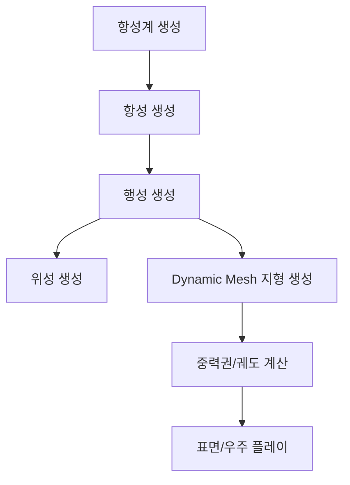

# StarRovers

업데이트: 2026-05-25

## 1. 문서 개요

StarRovers는 Unreal Engine 기반의 2.5D 태양계 경영 게임이다. 플레이어는 항성계 안에서 행성, 위성, 우주선, 자원, 거주지, 궤도 시설을 관리한다.

이 문서는 새 세션의 AI가 작업 전 읽어야 하는 기준 문서다. 실제 코드/에셋 상태와 목표 구조를 구분해서 다루며, `.uasset`은 텍스트처럼 직접 수정하지 않는다.

## 2. 작업 전 확인 순서

1. README.md를 목차 순서대로 읽는다.
2. 사용자가 지시한 대상과 관련 클래스만 추가로 확인한다.
3. 코드와 에셋 상태를 기준으로 말하고, 구현되지 않은 목표를 완료된 것처럼 말하지 않는다.
4. 빌드, 에디터 실행, PIE 실행은 사용자가 요청한 경우에만 진행한다.

## 3. 목표

장기 목표는 데이터 기반 항성/행성/위성 생성, 절차적 행성 지형, 중력권과 궤도 기반 우주 항행, 행성 표면과 우주 공간을 오가는 2.5D 플레이, 태양계 단위 경영 시뮬레이션이다.

현재는 항성/행성/위성의 C++ 클래스, Blueprint, Data Asset, 컴포넌트 구조를 정리하면서 Dynamic Mesh 기반 행성 지형 생성을 확장하는 단계다.

## 4. 현재 구조

### 4.1 게임 흐름

```mermaid
flowchart TD
    Start[항성계 생성] --> Star[항성 생성]
    Star --> Planets[행성 생성]
    Planets --> Moons[위성 생성]
    Planets --> Terrain[Dynamic Mesh 지형 생성]
    Terrain --> Gravity[중력권/궤도 계산]
    Gravity --> Gameplay[표면/우주 플레이]
```

### 4.2 천체 클래스

- 공통 천체 Actor는 `ASRCelestialBody` / `BP_CelestialBody`다.
- 항성은 `ASRStar` / `BP_Star`를 사용한다.
- 행성과 위성은 모두 `ASRPlanet` / `BP_Planet`을 사용하고, 차이는 Data Asset 수치와 `BodyCategory`로 구분한다.
- Moon 전용 Blueprint Class는 사용하지 않는다.

`BP_CelestialBody`의 공통 Native 컴포넌트는 `CelestialBodyStaticMesh`, `CelestialBodyDynamicMesh`, `ClickSphereCollision`, `GravityParent`, `GravityLineBatch`다. `Ocean`, `ProceduralTerrain`, `Orbit`은 공통 BP가 아니라 필요한 타입 쪽에서 다룬다.

`ASRPlanet`은 `Orbit`, `OceanStaticMesh`, `SurfaceGrid`를 Native 컴포넌트로 가진다. `SurfaceGrid` 타입은 `USRPlanetSurfaceGrid`다. 현재 `SurfaceGrid` 활성화는 `BodyCategory == Planet`일 때만 허용하므로, Moon은 Dynamic Mesh terrain은 생성될 수 있지만 표면 grid는 숨겨진다.

### 4.3 Data Asset 항목

Star Data Asset의 `Star Rovers` 항목은 `Identity`, `CelestialBody`, `Gravity`, `Star`다.

- `Identity`: `VariableName`, `BodyCategory`
- `CelestialBody`: `Scale`, `StaticMesh`, `Material`
- `Gravity`: `Mass`, `GravityRatio`, `GravityRadiusRatio`
- `Star`: `StarPointLightIntensity`, `StarPointLightColor`

Star Material의 emissive scalar 값은 Material 또는 Material Instance에 저장된 값을 그대로 사용한다. C++는 `Emissive Strength`, `EmissiveStrength`, `GlowIntensity`, `Glow`, `Intensity`, `Brightness` 같은 scalar parameter를 덮어쓰지 않는다.

Planet/Moon Data Asset의 `Star Rovers` 항목은 `Identity`, `CelestialBody`, `Gravity`, `Orbit`, `Surface`, `Dynamic Mesh Generation`, `Ocean`이다. `Surface`에는 `SurfaceGridHeightOffset`, `ConstructionHeightOffset`을 둔다. `Dynamic Mesh Generation`에는 `bMinecraft`를 포함한 `FSRDynamicMeshGeneration` 값을 직접 노출한다. `bMinecraft`가 true이면 Dynamic Mesh와 Surface Grid 높이를 `DynamicMeshHeight / 24` 단위로 계단화하고, false이면 terrain sample의 높이 값을 그대로 사용한다.

### 4.4 Generator와 Camera

`ASRSolarSystemGenerator`는 게임 월드 `BeginPlay`에서 `GenerateRuntimeSystem()`을 호출한다. 별도 자동 생성 On/Off 옵션은 두지 않는다. 행성/위성 생성 개수는 Data Asset이 아니라 generator의 `MinPlanet`, `MaxPlanet`, `MinMoon`, `MaxMoon`에서 결정한다.

생성기는 랜덤 선택된 Star/Planet/Moon Data Asset에 필수 spec, mesh, material, `VariableName`이 없으면 fallback 후보로 대체하지 않고 Error를 기록한 뒤 해당 생성 과정을 중단한다. 궤도 packing이 부모 중력 반경에 맞지 않는 경우에도 후보 수를 줄여 재시도하지 않고 Error를 기록한다.

`ASRCameraPawn`은 `SpringArm.TargetArmLength`로 zoom을 제어하고, `BP_Space`의 PrimitiveComponent bounds를 기준으로 최대 zoom과 drag/focus pivot 위치를 제한한다. `SpringArm` collision test는 사용하지 않는다.

현재 Static/Dynamic Mesh 전환 로직은 `ASRCameraPawn::ShouldUseDynamicMesh()`에 있다. 코드 기준으로는 `DynamicMeshThreshold` 프로퍼티와 threshold 비교가 구현되어 있지 않다. 현재 조건은 천체가 카메라 앞에 있고, 반지름 계산이 가능하며, frustum 안에 걸쳐 있으면 Dynamic Mesh 사용 대상으로 판단하는 방식이다.

## 5. Dynamic Mesh Generation

### 5.1 설정 위치

Planet/Moon Data Asset의 `Dynamic Mesh Generation` 항목은 `FSRDynamicMeshGeneration` struct를 직접 노출한다.

주요 값은 다음과 같다.

- `bDynamicMeshGeneration`
- `bMinecraft`
- `BiomeProfile`
- `BiomeMaterials`
- `GenerationSeed`
- `DynamicMeshHeight`
- `OceanThreshold`
- `ContinentFrequency`
- `MountainFrequency`
- `MountainStrength`
- `ValleyStrength`
- `RiverStrength`
- `LakeStrength`
- `TemperatureFrequency`
- `MoistureFrequency`
- `DetailFrequency`
- `DetailStrength`
- `NoiseStrength`
- `NoiseOctaves`
- `NoisePersistence`

현재 C++ 생성자 기본값은 Planet DA가 `EarthLike`, Moon DA가 `RockyMoon`이다. 기존에 저장된 `.uasset` Data Asset은 C++ 생성자 기본값이 자동으로 덮이지 않을 수 있으므로, 실제 값은 에디터에서 직접 확인해야 한다.

### 5.2 생성 데이터 흐름

1. Planet/Moon Data Asset의 `BuildData()`가 `FSRDynamicMeshGeneration`을 `FSRCelestialBodyData.DynamicMeshGeneration`으로 복사한다.
2. `ASRSolarSystemGenerator`가 행성/위성 생성 요청을 만들 때 `GenerationSeed`를 랜덤으로 정하고, 같은 값을 `DynamicMeshGeneration.GenerationSeed`에 넣는다.
3. `ASRCelestialBody::SetData()`가 `DynamicMeshGeneration`을 Actor 내부 상태로 복사한다.
4. `ASRCelestialBody::ApplyData()`가 `EnsureCelestialBodyDynamicMeshVisuals()`를 호출한다.
5. `EnsureCelestialBodyDynamicMeshVisuals()`가 Static Mesh와 Material을 검증하고, `CopyStaticMeshToCelestialBodyDynamicMesh()`로 Dynamic Mesh를 만든다.
6. `ASRPlanet::ApplyData()`는 같은 `DynamicMeshGeneration`을 `SurfaceGrid->ConfigureTerrain()`에도 넘긴다.

### 5.3 Mesh 생성 방식

`CopyStaticMeshToCelestialBodyDynamicMesh()`는 Data Asset의 `CelestialBody > StaticMesh`에 지정된 Static Mesh의 LOD0 render data를 읽는다. vertex buffer, index buffer, normal, vertex color, material id를 기반으로 `UDynamicMeshComponent`에 들어갈 `FDynamicMesh3`를 만든다.

절차 지형 생성 경로는 다음 조건을 모두 만족할 때만 사용한다.

- `BodyCategory`가 `Planet` 또는 `Moon`
- `bDynamicMeshGeneration == true`
- `DynamicMeshHeight > 0`
- 원본 Static Mesh 삼각형을 사각형 cell로 복원할 수 있음

조건을 만족하면 원본 삼각형 두 개를 하나의 quad cell로 복원한다. 각 cell 중심 방향을 기준으로 `FSRPlanetTerrainGenerator::SampleTerrain()`을 호출하고, 반환된 `HeightOffset`에 따라 cell 네 꼭짓점을 천체 중심 기준으로 scale up/down한다.

`bMinecraft`가 true이면 높이는 `DynamicMeshHeight / 24` 단위로 계단식 quantize된다. false이면 sampler가 반환한 `HeightOffset`이 그대로 적용된다. 인접 cell 높이가 다르면 side wall face를 추가해 틈을 막는다. 각 surface quad와 side wall에는 vertex color가 기록되고, `BiomeMaterials`가 있으면 biome별 material slot id도 지정한다.

quad 복원에 실패하면 Error가 아니라 Warning을 남기고, 원본 triangle mesh를 변형 없이 Dynamic Mesh로 복사한다. 이 fallback에서는 procedural terrain 높이 변형이 적용되지 않는다.

### 5.4 Terrain Sampler

현재 구현된 `BiomeProfile`은 `None`, `EarthLike`, `GasGiant`, `RockyMoon`, `MarsLike`, `IceWorld`, `Volcanic`, `OceanWorld`다.

`None`과 `GasGiant`는 procedural terrain을 생성하지 않는다. 그 외 profile은 현재 같은 Minecraft Overworld 스타일 sampler를 공유한다. `OceanWorld`만 continentalness bias를 낮춰 바다 비중을 키운다. 완전한 Minecraft 원본 noise/router 이식은 아니며, 현재 프로젝트의 정사각형 cell 지형에 맞춘 deterministic noise 근사다.

sampler는 다음 개념을 섞어 `FSRPlanetTerrainSample`을 만든다.

- `continentalness`: 바다, 해안, 내륙 구분
- `erosion`: 산지 억제와 평지 경향
- `peaks and valleys`: 봉우리와 골짜기 패턴
- `ridged noise`: 능선과 산맥 보강
- `detail noise`: 미세 높이 변화
- `temperature`, `humidity`: biome 판정
- `river`, `lake` mask: 물길/호수 carve와 coast 처리

`DetailFrequency`는 detail noise를 얼마나 촘촘하게 샘플할지 정한다. 값이 높을수록 작은 기복이 더 자주 나온다. `DetailStrength`는 그 detail noise가 최종 `HeightOffset`에 더해지는 세기다. 즉 `DetailFrequency`는 패턴의 스케일, `DetailStrength`는 높이 반영량을 제어한다.

`NoiseOctaves`와 `NoisePersistence`의 `Noise`는 `SampleFractalNoise()`가 여러 겹으로 합성하는 Perlin noise를 뜻한다. `NoiseOctaves`는 합성할 레이어 수이며 continentalness, erosion, weirdness, detail 계열 샘플에 쓰인다. `NoisePersistence`는 다음 octave로 넘어갈 때 amplitude가 얼마나 유지되는지 정하며, 현재 코드에서는 detail noise의 persistence 값에 직접 반영된다.

`Detail`은 최종 높이에 더해지는 작은 표면 기복 항목이다. `Noise`는 그 detail뿐 아니라 continentalness, erosion, weirdness, temperature, moisture, river, lake mask를 만드는 기반 샘플링 방식 전체를 가리킨다. `NoiseStrength`는 noise를 샘플하기 전에 방향 벡터를 다른 noise 값으로 살짝 휘게 만드는 강도다. 값이 커질수록 대륙선, 산맥, 기후 패턴이 직선적이거나 균일하게 반복되지 않고 더 뒤틀린 형태가 된다.

`FSRPlanetTerrainSample`은 `HeightOffset`, `Continent`, `MountainMask`, `Temperature`, `Moisture`, `RiverMask`, `LakeMask`, `PlateBeltMask`, `Biome`, `SurfaceColor`를 반환한다. Dynamic Mesh는 `SurfaceColor`를 vertex color로 기록하므로, Data Asset의 Material이 Vertex Color를 Base Color 또는 색상 블렌딩에 사용해야 지형 색이 화면에 반영된다.

### 5.5 Ocean과 Surface Grid

Ocean scale은 `ASRPlanet::EstimateProceduralOceanScaleMultiplier()`가 terrain sample을 512개 방향에서 샘플링해 물 biome의 가장 높은 높이를 찾고, 약간의 padding을 더해 자동 추정한다. 물 sample이 없거나 procedural terrain이 꺼져 있으면 내부 `OceanScaleMultiplier` 값을 사용한다.

Surface Grid는 Planet에서만 켜진다. `ASRPlanet::ApplyData()`가 body radius를 기준으로 `FaceResolution`을 자동 계산하고, `SurfaceGrid->ConfigureTerrain(DynamicMeshGeneration)`을 호출한다. Surface Grid는 collision trace로 표면을 다시 찾지 않고, Dynamic Mesh Generation과 같은 height/normal 계산을 사용한다.

### 5.6 Dynamic Mesh / Assembly Mode 최적화

Dynamic Mesh 생성은 복원된 quad cell별 render data를 함께 기록한다. `ASRCelestialBody::CopyStaticMeshToCelestialBodyDynamicMesh()`는 생성된 `FSRPlanetSurfaceGridCell` 목록을 캐시하고, 각 cell을 surface 및 side face의 vertex color element와 매핑한다. `USRPlanetSurfaceGrid`는 같은 StaticMesh에서 quad를 다시 복원하지 않고 이 캐시된 cell 목록을 재사용한다.

Hover와 Select 색상은 가능한 경우 별도 mesh를 덮는 방식이 아니라 기존 행성 Dynamic Mesh의 vertex color를 `UDynamicMesh::EditMesh()`로 직접 수정한다. 이 경로에서는 선택된 cell의 top surface와 side face 색상이 함께 바뀐다. Dynamic Mesh cell color data가 없는 fallback 상황에서만 interaction overlay mesh를 사용한다.

Assembly Mode의 grid drawing은 recovered quad cell을 사용할 때 owner Dynamic Mesh 전체 edge scan을 건너뛴다. Grid line은 캐시된 cell corner에서 직접 만들고, shared edge는 중복 생성하지 않는다. 숨겨진 grid는 `bCellsDirty`, `bGridMeshDirty`로 cell/mesh rebuild를 지연하고, 실제 preparation 또는 visibility 전환이 필요할 때만 갱신한다.

Focus 전환 후에는 focused planet grid를 `PrepareGridForAssembly()`로 짧게 지연 prewarm한다. 따라서 Assembly Mode 진입 시점에는 가능한 한 visibility 전환만 일어나게 한다. Hover raycast는 face별 32x32 spatial bin index로 후보 cell을 줄이고, 마우스가 움직이지 않은 경우에는 같은 raycast를 매 tick 반복하지 않는다.

## 6. 현재 에셋 상태

확인된 주요 Blueprint Class 에셋은 다음과 같다.

- `Content/BlueprintClasses/CelestialBody/BP_CelestialBody.uasset`
- `Content/BlueprintClasses/CelestialBody/BP_Planet.uasset`
- `Content/BlueprintClasses/CelestialBody/BP_Space.uasset`
- `Content/BlueprintClasses/CelestialBody/BP_Star.uasset`
- `Content/BlueprintClasses/Core/BP_SRCameraPawn.uasset`
- `Content/BlueprintClasses/Core/BP_SRGameMode.uasset`
- `Content/BlueprintClasses/Core/BP_SRPlayerController.uasset`
- `Content/BlueprintClasses/Generator/BP_SolarSystemGenerator.uasset`
- `Content/BlueprintClasses/UI/WBP_FocusInfo.uasset`
- `Content/BlueprintClasses/UI/WBP_Overview.uasset`
- `Content/BlueprintClasses/UI/WBP_TimeControl.uasset`

확인된 Data Asset 에셋은 다음과 같다.

- `Content/BlueprintClasses/CelestialBody/DA_Star_MainSequenceStar.uasset`
- `Content/BlueprintClasses/CelestialBody/DA_Planet_LavaOcean.uasset`
- `Content/BlueprintClasses/CelestialBody/DA_Moon_BadLands.uasset`

최근 C++ 이름 변경에 대한 리다이렉트는 두지 않는다. Blueprint 부모 클래스, Data Asset 타입, 저장된 SCS 컴포넌트 중복 여부는 에디터에서 확인해야 한다.

## 7. 설계 원칙

1. 부모 클래스에는 모든 천체가 실제로 공유하는 정체성과 최소 공통 컴포넌트만 둔다.
2. 항성/행성/위성 전용 기능은 각 타입의 BP, C++ 클래스, 전용 컴포넌트에 둔다.
3. Data Asset은 수치를 담고, Actor/Component는 동작을 담당한다.
4. 값을 0 또는 Null로 둬서 기능을 끄는 방식은 임시 호환에는 쓸 수 있지만 장기 구조의 기본값으로 삼지 않는다.
5. Blueprint/Details 패널에서 직접 설정 가능한 옵션은 C++에서 임의로 강제하지 않는다.

## 8. 작업 규칙

### 8.1 코드 작업

- 변경 전 관련 파일을 먼저 읽는다.
- 참조 검색은 `rg`를 우선 사용한다.
- 수동 코드 수정은 가능한 한 `apply_patch`를 사용한다.
- 사용자 변경을 임의로 되돌리지 않는다.
- 빌드는 사용자가 요청한 경우에만 실행한다.

### 8.2 Unreal 에셋 작업

- `.uasset`과 `.umap`은 텍스트 파일처럼 직접 편집하지 않는다.
- Blueprint 부모 클래스 변경, SCS 컴포넌트 삭제, Data Asset 값 수정은 에디터에서 확인한다.
- C++ Native 컴포넌트를 제거해도 기존 Blueprint에 저장된 컴포넌트는 에디터에서 직접 정리해야 할 수 있다.

### 8.3 Naming 규칙

프로젝트 C++ prefix는 `SR`이다. Unreal C++ 접두어는 엔진 관례를 따른다.

- `A`: Actor
- `U`: UObject, Component, Data Asset, Subsystem
- `F`: Struct
- `E`: Enum
- `I`: Interface

에디터 에셋 접두어는 `BP_`, `DA_`, `WBP_`, `M_`, `MI_`, `T_`, `SM_`를 사용한다.

주요 이름 정리:

- `AProceduralCelestialBody` -> `ASRCelestialBody`
- `BP_CelestialBodyType` -> `BP_CelestialBody`
- `BP_PlanetBody` / `BP_MoonBody` -> `BP_Planet`
- `UStarRoversGravitySourceComponent` -> `USRGravityParent`
- `UStarRoversGravityReceiverComponent` -> `USRGravityChild`
- `UStarRoversOrbitComponent` -> `USROrbit`
- `USRPlanetSurfaceGridComponent` -> `USRPlanetSurfaceGrid`
- `ASRStarMapCameraPawn` -> `ASRCameraPawn`
- `ASRStarMapPlayerController` -> `ASRPlayerController`
- `ASRStarMapGameMode` -> `ASRGameMode`

## 9. Git 규칙

- `.gitattributes`로 텍스트 파일의 줄바꿈은 LF로 고정한다.
- `.uasset`, `.umap`, 이미지, 오디오, 압축, 3D 에셋은 binary로 취급한다.
- `Binaries/`, `Intermediate/`, `Saved/`, `DerivedDataCache/`, `.vs/`, `.sln`은 `.gitignore`로 제외한다.
- 커밋 전 줄바꿈 정책을 반영해야 할 때는 `git add --renormalize .`를 실행한 뒤 `git add .`와 `git status`로 확인한다.

## 10. README 업데이트 규칙

README.md는 구조 변경이 있을 때 함께 갱신한다.

1. 실제 코드/에셋 상태와 목표 구조를 구분해서 기록한다.
2. 완료된 변경과 에디터에서 확인해야 하는 변경을 구분한다.
3. 이름 변경이 있으면 이전 이름과 새 이름을 함께 적는다.
4. 사용자가 빌드하지 말라고 한 경우 빌드 결과를 기록하지 않는다.
5. 인코딩은 UTF-8로 유지한다.
